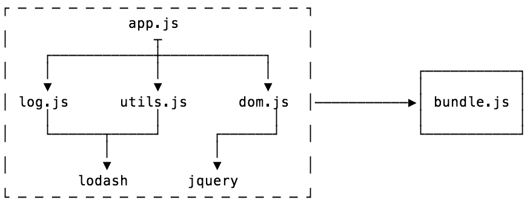
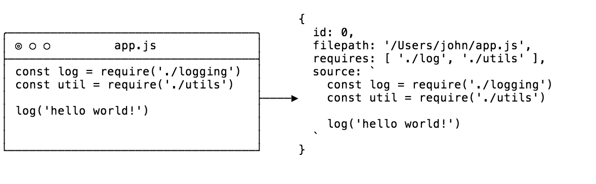
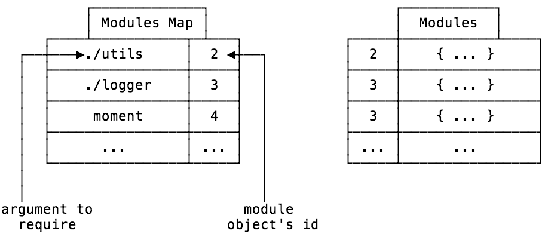

* 原文地址：https://adamisntdead.com/lets-write-a-module-bundler/
* 译文出自：TWNTF
* 译者：wtzeng

# 手写简单的模块打包器，了解一下

> 在 Github 查看源码<sub>[1]</sub>: [Github](https://github.com/adamisntdead/wbpck-bundler)

你好，欢迎欢迎！很高兴你能来到这。今天，我们来搭建一个非常简单的 Javascript 模块打包器。

在开始之前，我想先明确一个事情，我的这篇文章很大程度上基于这些项目:

* [Unbundling the JavaScript module bundler](http://loige.link/bundle-dublinjs) - Luciano Mammino
* [Minipack](https://github.com/ronami/minipack) - Ronen Amiel

好了，让我们用一个问题开始，模块打包器究竟是什么呢？

## 什么是模块打包器？

你可能已经用过一些类似 Browserify, Webpack, Rollup 的模块打包器，模块打包器是一个工具，它可以把分块的 Javascript 代码以及这些代码所依赖的模块都打包成一个 Javascript 文件，最后打包出来的文件通常在浏览器中运行。

打包通常从一个入口文件开始，最终将所有需要的文件打包到一个文件中。



打包器主要进行两步任务:

1. 依赖解析
2. 打包模块

打包从入口处(如上图中是 `app.js`)开始，依赖解析的目标是找到你的代码的所有依赖 - 也就是代码运行所需要的其它代码片段 - 并且建立上面那样的一个图(叫作依赖图)。

一旦这步完成了，你就可以接着进行打包了，也就是把你的依赖图变成一个你可以真正使用的单个 Javascript 文件。

让我们以一些模块的引入来开始我们的代码吧(我会在后面进行讲解)

```Javascript
const detective = require('detective')
const resolve = require('resolve').sync
const fs = require('fs')
const path = require('path')
```

## 依赖解析

我们必须要做的第一件事情是思考怎样在依赖分析的阶段中来表示一个模块。

### 模块表示

对于一个模块，我们需要四个东西:

* 文件的名称和标识
* 文件如何在文件系统中引入
* 文件中的源码
* 文件对应的依赖

依赖图的结构可以用递归的方式来构建。

在 Javascript 中，表示这种数据集的最简单方式是采用对象来表示，所以我们打算这样做:

```Javascript
let ID = 0
function createModuleObject(filepath) {
  const source = fs.readFileSync(filepath, 'utf-8')
  const requires = detective(source)
  const id = ID++

  return { id, filepath, source, requires }
}
```

我们来看一下 `createDependencyObject` 函数，值得注意的地方是 `detective` 这个函数的调用。

[Detective](https://github.com/browserify/detective) 是一个用于"遍历依赖图，找到所有的 require() 引入的库"，使用它可以让我们少做很多遍历抽象语法树的工作。

一件值得注意的事是(几乎在所有的模块打包器中都是这样)，如果你试图做像下面一样秀一波打包器:

```Javascript
const libName = 'lodash'
const lib = require(libName)
```

打包器是不能解析到这个依赖的(因为这些是运行时才执行的代码)。

那么向这个函数传入模块的路径，我们可以得到什么呢？



接下来做什么？我们开始进行依赖图的解析

首先，我想聊一个叫作模块映射(module map)的东西。

### 模块映射

当你在 Node 中引入一个模块时，你可以用相对路径来引入，例如: `require('./utils')`。那么被打包器打包以后的代码在运行时，怎样准确地知道这个 './utils' 对应什么东西呢？

这就是模块映射想解决的问题。

我们定义的模块对象有一个作为唯一标识的 id，可以对其加以利用。当我们在做依赖解析时，对每一个模块我们需要记录一份列表，这份列表里面保存了当前模块所依赖模块对应的路径和id，这样我们就可以在运行时取得正确的依赖模块。

这也意味着我们可以把所有模块的信息存储在一个非嵌套式的对象中，使用 id 作为对象的 key。



### 解析

```Javascript
function getModules(entry) {
  const rootModule = createModuleObject(entry)
  const modules = [rootModule]

  // 遍历所有的模块，包括新增进数组的
  for (const module of modules) {
    module.map = {} // 用于保存模块映射关系

    module.requires.forEach(dependency => {
      const basedir = path.dirname(module.filepath)
      const dependencyPath = resolve(dependency, { basedir })

      const dependencyObject = createModuleObject(dependencyPath)

      module.map[dependency] = dependencyObject.id
      modules.push(dependencyObject)
    })
  }

  return modules
}
```

搞定，这样 `getModules` 函数会得到依赖图中所有的模块。这个函数的作用是从 root/entry 开始，递归地查找解析所有的依赖。

那么"依赖解析"是什么意思呢？在 Node 中有一个 `require.resolve` 方法，Node 需要通过它来确定文件中引入的模块，这是因为我们既可以用相对路径引入模块，也可以从 `node_modules` 目录中引入模块。

幸运的是，我们可以用一个叫 `resolve` 的库来做与 `require.resolve` 类似的事情。我们只要把使用的引入路径和 `basedir` 作为参数传入，就可以得到模块的依赖路径。

这样，我们就完成了对项目中每个模块的依赖的解析。

同时我们也创建了之前提到的模块映射关系 `map`。

在这个函数的最后，我们得到了一个叫作 `modules` 的数组，里面保存了项目中所有模块/依赖对应的模块对象。

有了这些东西，我们就可以做最后一步了 - 打包！

## 打包模块

在浏览器中，没有模块之类的东西，也就是说，没有 `require` 函数，没有 `module.exports`，所以即使我们现在有了所有的依赖模块，也没法把它们当作模块来使用。

### 模块工厂函数

工厂函数是一种用于生成对象的函数(但不是构造函数)。这是一种面向对象的编程模式，它其中的一个用途就是封装和依赖注入。

听起来不错吧？

使用工厂函数，我们可以同时注入 `require` 函数和 `module.exports` 对象，以便打包后的代码可以使用，并且可以给打包后的代码模块它自己的作用域。

```Javascript
// 一个工厂函数
(require, module) => {
  /* 模块代码 */
}
```

### 打包

先来看一眼 `pack` 函数，之后我将会对其作出解释。

```Javascript
function pack(modules) {
  const modulesSource = modules.map(module => 
    `${module.id}: {
      factory: (module, require) => {
        ${module.source}
      },
      map: ${JSON.stringify(module.map)}
    }`
  ).join()

  return `(modules => {
    const require = id => {
      const { factory, map } = modules[id]
      const localRequire = name => require(map[name])
      const module = { exports: {} }

      factory(module, localRequire)

      return module.exports
    }

    require(0)
  })({ ${modulesSource} })`
}
```

代码的大部分都是 Javascript 中的模板字符串，我们来看看它做了什么吧。

首先出现的是 `moduleSource`，在这块代码中，我们遍历了所有的模块，并且把他们转换成了包含源代码的字符串。

那么对一个模块对象来说，这种转换输出了什么东西呢？


接下来的步骤就有点难懂了，但是你可以发现我们做的事是把源码包裹了起来，并利用之前提到的工厂函数，向其提供 `module` 和 `require`。

我们也使用到了在依赖解析步骤中创建的模块映射。

接下来我们把所有模块转换得到的字符串都连接起来，用于创建一个包含了所有依赖信息的大对象。

再接着的字符串代码是一个立即执行函数表达式(IIFE)，就是说当你在浏览器(或者任何其它地方)运行你的代码时，这个函数会立即被调用。IIFE 是另一种封装作用域的模式，我们在这里使用它可以避免 `require` 和 modules 污染全局作用域。

你可以看到，我们定义了两个函数，`require` 和 `localRequire`。

`require` 接收模块的 id 作为参数，但在我们的源码中，并不是用 id 作为模块引用的依据的，所以在这里我们用另一个函数 `localRequire` 来把源码中 require 接收到的任何参数转换成对应的模块 id。这里就需要用到我们创建的模块映射。

在这之后，我们定义了一个 `module` 对象，再把工厂函数需要的 `module` 和 `require` 传递进去并执行，然后返回 `module.exports`。

最后，我们执行 `require(0)` 来引用 id 为 0 的模块，即我们的入口文件模块。

以上，我们的模块打包器就100%完成了！

```Javascript
module.exports = entry => pack(getModules(entry))
```

## 写在最后

现在我们就拥有了一个可以工作的模块打包器了。

这个模块打包器可能不能用于生产环境中，因为它还少了许多特性(比如管理循环依赖，确保每个文件只被编译一次，处理 ES 模块等等)，但我希望它可以让你了解到一个模块打包器的实现原理。

事实上，这个模块打包器的实现部分只用了不到60行代码。

感谢你的耐心阅读，希望你通过这个简单的模块打包器实现方案能有所收获！

---

译者注:

1. 原项目依赖的 `resolve` 包更新了同步 resolve 的 API为 `resolve.sync`，这是利用新 API 实现的[代码](https://github.com/wtzeng1/wbpck-bundler)