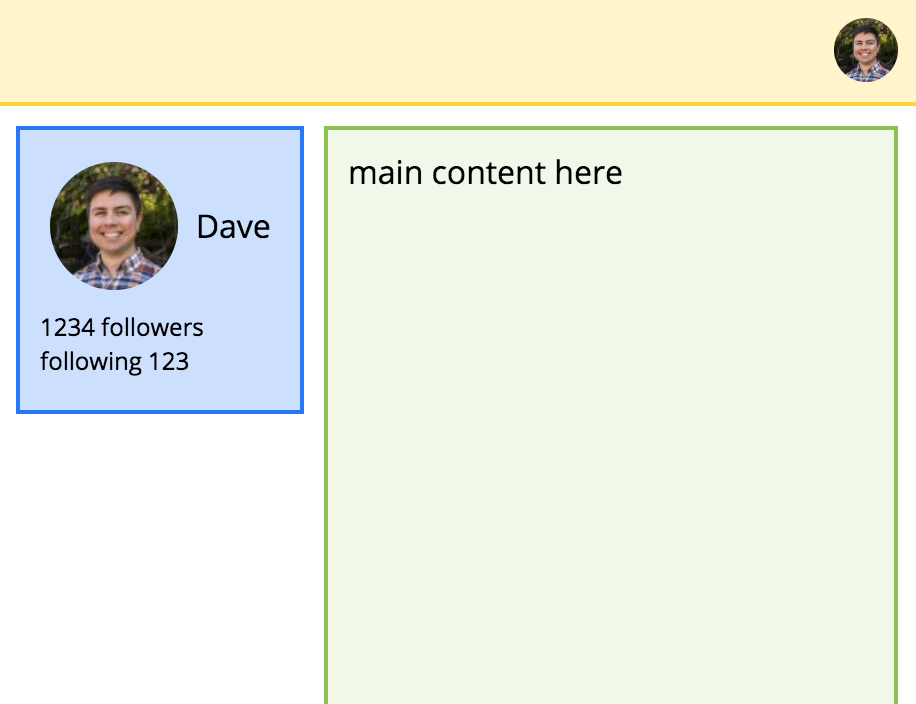
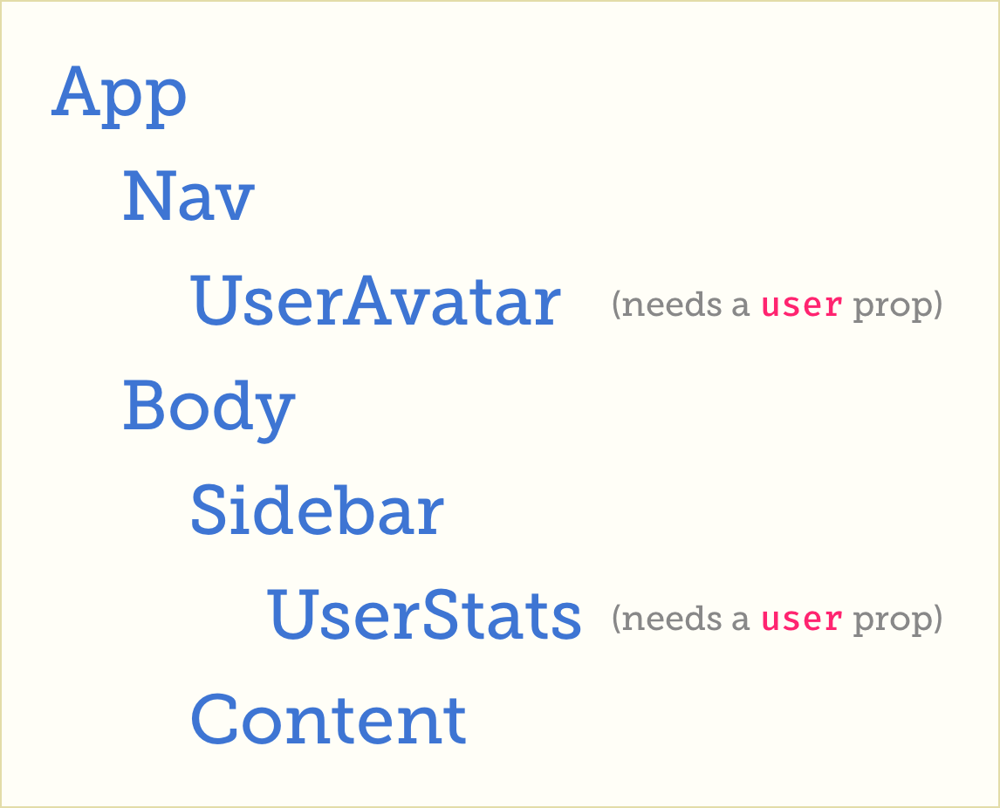
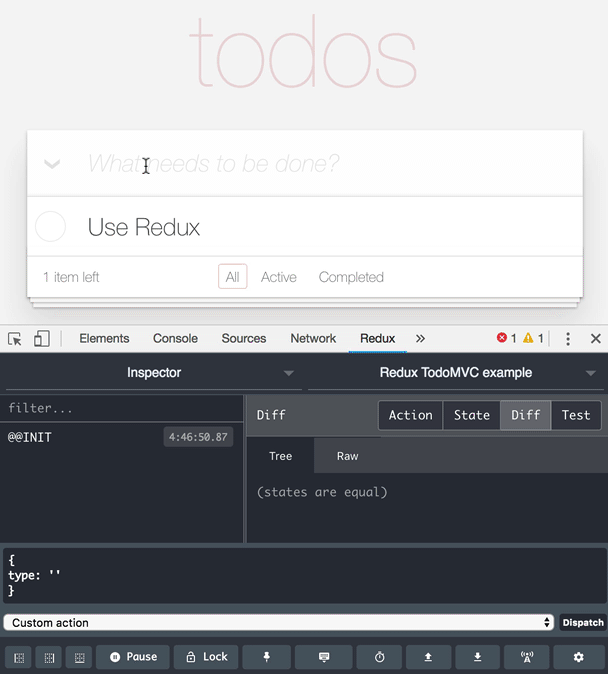
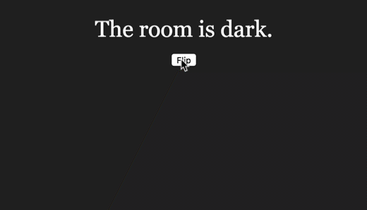

* 原文地址：https://daveceddia.com/context-api-vs-redux/#how-to-use-the-react-context-api
* 译文出自：TWNTF
* 译者：Yingjian Li


# 对比 Redux 和 Context API


React 在 16.3 版本中添加了一个新的 Context API， 「新」的意思是指之前的 Context API 是一个隐藏的功能。 由于在官方文档中并不鼓励使用 Context API， 大多数人都避免使用它，甚至都不知道它的存在。

而现在 Context API 变成了 React 中的一等公民， 并且开放给了所有人(来自官方推广)。

React 16.3 一发布， 网上的很多文章就因新 Context API 的出现，宣布「Redux 已死」。 然而如果你问过 Redux，我相信它会回答你:「那些言论都是[夸大其词](https://blog.isquaredsoftware.com/2018/03/redux-not-dead-yet/)」。

本文将会介绍新 Context API 是如何工作的， 它与 Redux 的相似之处， 什么时候应该选用 Context，以及为什么 Context 并不能完全取代 Redux。

如果你只想大致了解 Context， 可以直接[查看](#how-to-use-context-api)。

## 一个简单的 React 例子

现在，假设你已经清楚 React 的基础概念(props & state)， 如果你还不清楚， 这里有一个免费的五天课程可以帮助你[学习 React](https://daveceddia.com/pure-react-email-course)。

让我们看一下这个大多数人会选择使用 Redux 的例子.我们首先从简单的纯 React 版本开始，再看一下如何使用 Redux，最后是 Context。



这个 app 在两处地方显示用户的信息:一个是在导航栏的右上角，一个是在主要内容左侧的侧栏。

(你也许注意到了， 这看起来很像 Twitter。这并非偶然！ 磨炼 React 技术最好的方法就是[模仿](https://daveceddia.com/learn-react-with-copywork/))。

组件结构如下图:



如果只使用 React(普通的 props)， 需要把用户信息存在组件树中足够高的位置， 以便于把 props 向下传递到需要的组件中。在这种情况下，用户信息只能存储在`App`中。

然后，为了将 props 传递到需要的组件中，App 需要把 props 先传递到 Nav 和 Body 中。 然后需要再依次向下传递，到 UserAvatar(万岁!)和 Sidebar 中。最后， SideBar 必须再向下传递到 UserStats 中。

下面让我们看看如何用代码实现(我将所有的内容放到了一个文件中来增加易读性，但在真实情况下可能需要按照[某种标准结构](https://daveceddia.com/react-project-structure/)将它拆成多个独立的文件)。

```Javascript
import React from "react";
import ReactDOM from "react-dom";
import "./styles.css";

const UserAvatar = ({ user， size }) => (
  
);

const UserStats = ({ user }) => (
  <div className="user-stats">
    <div>
      <UserAvatar user={user} />
      {user.name}
    </div>
    <div className="stats">
      <div>{user.followers} Followers</div>
      <div>Following {user.following}</div>
    </div>
  </div>
);

const Nav = ({ user }) => (
  <div className="nav">
    <UserAvatar user={user} size="small" />
  </div>
);

const Content = () => <div className="content">main content here</div>;

const Sidebar = ({ user }) => (
  <div className="sidebar">
    <UserStats user={user} />
  </div>
);

const Body = ({ user }) => (
  <div className="body">
    <Sidebar user={user} />
    <Content user={user} />
  </div>
);

class App extends React.Component {
  state = {
    user: {
      avatar:
        "https://www.gravatar.com/avatar/5c3dd2d257ff0e14dbd2583485dbd44b"，
      name: "Dave"，
      followers: 1234，
      following: 123
    }
  };

  render() {
    const { user } = this.state;

    return (
      <div className="app">
        <Nav user={user} />
        <Body user={user} />
      </div>
    );
  }
}

ReactDOM.render(<App />， document.querySelector("#root"));
```

[CodeSandbox 上的示例。](https://codesandbox.io/s/q8yqx48074)

在上面的代码中， `App`[初始化](https://daveceddia.com/where-initialize-state-react/)了包含 user 对象的 state， 在实际情况下，你可能需要[从服务端获取数据](https://daveceddia.com/ajax-requests-in-react/)， 并将其保存在 state 中，用于渲染。

从 prop drilling 的角度来看，上面代码的问题并不严重。而且我们也绝对不会反对使用 prop drilling，它完全合理并且是 React 工作的核心方式。但是在写代码时层次过深会有一点厌烦，尤其当你需要传递多个 props 时。

Prop drilling 还有一个缺点就是:它使原本无关的组件之间产生了耦合。在上面的例子中，即使`Nav`并不需要`user`属性，但还是需要接收 user 属性，并且还要传递给`UserAvatar`。

紧耦合的组件(将 props 转发给子组件的组件)很难重用，因为在使用这类组件时，你需要在它们的父组件中准备好这些属性。

那么我们如何改进呢?

## 在使用 Redux 或 Context API 之前

如果你可以**合并**你的 app 结构，并且利用`childern`属性，无需借助 prop drilling， Context 或 Redux，也可以使你的代码会变得简洁。

对于像`Nav`，`Sidebar`和`Body`一样，需要成为占位符的组件来说，chilren 属性是一个很好的解决方案。众所周知，你可以使用**任何**属性传递 JSX 组件，并非一定要使用 children。因此如果你需要多个入口来注入组件，请牢记这一点。

这个版本的 React 示例中， `Nav`，`Body`和`Sidebar`接收 chilren 属性，并且按照他们原有的方式进行渲染。这样就不再需要担心如何传递特定的属性，只需要合理地使用组件自身的属性进行渲染即可。这个例子还展示了如何使用**任意**属性来传递 children。

(感谢 Dan Abramov 提出的[建议](https://twitter.com/dan_abramov/status/1021850499618955272)!)

```javascript
import React from "react";
import ReactDOM from "react-dom";
import "./styles.css";

const UserAvatar = ({ user， size }) => (
  
);

const UserStats = ({ user }) => (
  <div className="user-stats">
    <div>
      <UserAvatar user={user} />
      {user.name}
    </div>
    <div className="stats">
      <div>{user.followers} Followers</div>
      <div>Following {user.following}</div>
    </div>
  </div>
);

// 接收 children 并且渲染
const Nav = ({ children }) => (
  <div className="nav">
    {children}
  </div>
);

const Content = () => (
  <div className="content">main content here</div>
);

const Sidebar = ({ children }) => (
  <div className="sidebar">
    {children}
  </div>
);

// Body 需要一个 sidebar 和 content， 但用这种形式写，
// 他们可以是任何属性
const Body = ({ sidebar， content }) => (
  <div className="body">
    <Sidebar>{sidebar}</Sidebar>
    {content}
  </div>
);

class App extends React.Component {
  state = {
    user: {
      avatar:
        "https://www.gravatar.com/avatar/5c3dd2d257ff0e14dbd2583485dbd44b"，
      name: "Dave"，
      followers: 1234，
      following: 123
    }
  };

  render() {
    const { user } = this.state;

    return (
      <div className="app">
        <Nav>
          <UserAvatar user={user} size="small" />
        </Nav>
        <Body
          sidebar={<UserStats user={user} />}
          content={<Content />}
        />
      </div>
    );
  }
}

ReactDOM.render(<App />， document.querySelector("#root"));
```

[CodeSandbox 上的示例。](https://codesandbox.io/s/mj19ywz0oy)

如果你的 app 十分复杂(比这个例子复杂的多!)，可能很难使用`children`的模式。下面让我们将介绍如何使用 Redux 来避免 prop drilling。

## Redux 示例

我们先来看一下 Redux 的示例，再仔细观察 Context 是如何工作的。如果你对 Redux 并不熟悉，可以先阅读我写的[Redux 简介](https://daveceddia.com/how-does-redux-work/)(或者[观看视频](https://youtu.be/sX3KeP7v7Kg))。

将上面的 app 用 Redux 重构后，`user`信息存储在 Redux store 中。这意味着我们可以使用 react-redux 的`connect`方法直接向组件中注入`user`属性。

这样就实现了组件间的解耦。 `Nav`， `Body`和`Siderbar`不再接收和传递`user`属性。再也不需要接收无用的属性，再也不存在无用的耦合。

其中的 reducer 也都十分简单。我在[Redux 中的 reducers 是如何工作的](https://daveceddia.com/what-is-a-reducer/)和[如何写出 immutable 代码](https://daveceddia.com/immutable-updates-react-redux/)中对这方面知识进行了更详细的介绍。

```javascript
import React from "react";
import ReactDOM from "react-dom";

// 我们需要 createStore, connect 和 Provider:
import { createStore } from "redux";
import { connect, Provider } from "react-redux";

// 创建一个带有初始空 state 的 reducer
const initialState = {};
function reducer(state = initialState, action) {
  switch (action.type) {
    // 响应 the SET_USER 并更新 state
    case "SET_USER":
      return {
        ...state,
        user: action.user
      };
    default:
      return state;
  }
}

// 利用 reducer 创建 store
const store = createStore(reducer);

// 派发一个 action 来设置 user 的值
// 因为初始化的 state 是空的
store.dispatch({
  type: "SET_USER",
  user: {
    avatar: "https://www.gravatar.com/avatar/5c3dd2d257ff0e14dbd2583485dbd44b",
    name: "Dave",
    followers: 1234,
    following: 123
  }
});

// mapStateToProps 方法从 state 中抽取了一个 key（user）
// 并用`user`属性进行传递
const mapStateToProps = state => ({
  user: state.user
});

// connect() 使 UserAvatar 可以直接接收 `user`
// 而无需从父组件中接收

// 还可以分割成两个变量：
//   const UserAvatarAtom = ({ user, size }) => ( ... )
//   const UserAvatar = connect(mapStateToProps)(UserAvatarAtom);
const UserAvatar = connect(mapStateToProps)(({ user, size }) => (
  
));

// connect() 使 UserStats 可以直接接收`user`
// 而无需从父组件中接收
// 两个组件可以使用同一个 mapStateToProps 方法
const UserStats = connect(mapStateToProps)(({ user }) => (
  <div className="user-stats">
    <div>
      <UserAvatar />
      {user.name}
    </div>
    <div className="stats">
      <div>{user.followers} Followers</div>
      <div>Following {user.following}</div>
    </div>
  </div>
));

// Nav 不再需要知道 `user`
const Nav = () => (
  <div className="nav">
    <UserAvatar size="small" />
  </div>
);

const Content = () => <div className="content">main content here</div>;

// Sidebar 不再需要知道 `user`
const Sidebar = () => (
  <div className="sidebar">
    <UserStats />
  </div>
);

// Body 不再需要知道 `user`
const Body = () => (
  <div className="body">
    <Sidebar />
    <Content />
  </div>
);

// App 不再维护 state， 可以简化成一个无状态的函数
const App = () => (
  <div className="app">
    <Nav />
    <Body />
  </div>
);

// 将整个 app 用 Provider 包起来，使 connect()
// 能够连接到 store
ReactDOM.render(
  <Provider store={store}>
    <App />
  </Provider>,
  document.querySelector("#root")
);
```

[CodeSandbox 上的示例。](https://codesandbox.io/s/943yr0qp3o)

现在你也许想知道 Redux 是如何实现这种魔法的。这是个好问题，为什么 React 中不支持多层传递属性，而 Redux 就可以呢？

答案是 Redux 使用了 React 中的 Context 功能。不过不是新的 Context API，而是老版本 Context。 React 文档中明确说明，除非是用于第三方库或明确知道自己在做什么，否则不推荐使用 Context。

Context 就像是一个运行在组件身后的总线：如果你想从中接收电力（数据），只需要插上电源就可以了（React-Redux 的 `connect()`方法）。

这部分功能只是 Redux 的冰山一角。自由传递属性只是 Redux 最**表面**的功能。除此之外，Redux 还有一些其他的优点：

### 「纯」的`connect`

`connect` 会自动使连接的组件变成「纯组件」，这也就意味着它们只有在 props 发生变化，也就是 Redux store 中对应的值发生变化时才会重新渲染。这防止了不必要的重新渲染，保证 app 可以快速运行。DIY 方法：创建一个继承 `PureComponent` 的类，或自己实现`shouldComponentUpdate`。

### Redux 可以简化调试

actions 和 reducers 的样板代码带来的一个好处就是强大的调试功能。

使用 [Redux DevTools Extension](https://github.com/zalmoxisus/redux-devtools-extension) 可以帮助你自动记录 app 中的每一个 action。你可以在任何时候打开它，查看触发了哪些 actions，他们的 payload 是什么，以及 action 发生前后的 state 变化。



Redux DevTools 的另一个重要功能是时间旅行调试，也就是说你可以通过点击已发生的 action 跳转到该时间点，也就是重播在那之前的所有 actions（包含该 action 本身）。这是由于每个 action 都是 **immutably** 更新 state，因此你可以获取到 state 更新列表，并且无副作用的随意重播。

还有像 [LogRocket](https://logrocket.com/) 这种的工具，可以在每一个用户的**产品环境**上提供始终开启的 Redux DevTools。收到了 bug 报告？没问题，在 LogRocket 中查找用户的会话，你就可以看到他们的操作记录和触发的 actions。这一切都是通过挖掘 Redux 的 action 流完成的。

### 自定义 Redux 中间件

Redux 支持**中间件**。中间件的意思是「每次派发 action 时都会执行的方法」。实现你自己的中间件并没有看起来那么难，而且能够完成许多强大的功能。

例如：

- 想要在 action name 是以 `FETCH_` 为前缀时，开始 API 请求？ 你可以用中间件来实现。
- 想要在集中地将日志发送给分析软件？中间件是个不错的解决方案。
- 想要在特定时间内阻止某些特定 actions 触发？你可以使用中间件来实现，不会对 app 的其余部分产生影响。
- 想要自动地拦截带有 JWT token 的 action，并把他们存到 localStorage 中？没错，中间件。

这里有一篇关于[如何写 Redux 中间件](https://medium.com/@jacobp100/you-arent-using-redux-middleware-enough-94ffe991e6)的文章。

## <a name="how-to-use-context-api"></a>如何使用 Context API

但是也许你不需要 Redux 中那些花哨的功能。也许你不需要简单的调试，定制化，或性能提升，你只是希望数据的传递能变得简单些。也许你的 app 很小，或者需要先让某些功能正常工作后，再考虑引入一些其他的库。

React 的新 Context API 也许很适合你。让我们看看它是如何工作的。

我在 Egghead 上发布了一个简短的 Context API 课程， 如果你们更喜欢看视频，可以参考[这里](https://egghead.io/lessons/react-pass-props-through-multiple-levels-with-react-s-context-api)。

Context API 中有三个重要的部分：

- `React.createContext` 生成 Context。
- `Provider`（由`createContext`返回）创建贯穿整个组件树的「总线」。
- `Consumer`（也是由`createContext`生成，接通「总线」以获取数据。

这里的`Provider`和 React-Redux 里的`Provider`很像。接收任何形式的`value`属性（也可以是 Redux store，但是这样做很蠢）。大多数情况下都是包含一些数据和操作这些数据的方法的对象。

而`Consumer`和 React-Redux 的`connect`方法有点像，接通数据并提供给组件。

接下来是重点：

```javascript
// 首先，我们生成一个新的 Context
// 这是一个包含了两个属性的对象: { Provider, Consumer }
// 切记命名方式是帕斯卡式而不是驼峰式
// 这十分重要，因为我们一会要把它用作一个组件
// 组件名必须要以大写字母开始
const UserContext = React.createContext();

// 需要数据的组件使用 Consumer 属性接通 context
// Consumer 使用「render props」模式。
const UserAvatar = ({ size }) => (
  <UserContext.Consumer>
    {user => (
      
    )}
  </UserContext.Consumer>
);

// 注意，我们不再是需要 user 属性
// 因为 Consumer 可以从 context 中直接获取
const UserStats = () => (
  <UserContext.Consumer>
    {user => (
      <div className="user-stats">
        <div>
          <UserAvatar user={user} />
          {user.name}
        </div>
        <div className="stats">
          <div>{user.followers} Followers</div>
          <div>Following {user.following}</div>
        </div>
      </div>
    )}
  </UserContext.Consumer>
);

// ... 其他组件 ...
// ... 不在需要关注 `user` 属性

// 最后，在 App 中，我们利用 Provider
// 向下传递 context
class App extends React.Component
  state = {
    user: {
      avatar:
        "https://www.gravatar.com/avatar/5c3dd2d257ff0e14dbd2583485dbd44b",
      name: "Dave",
      followers: 1234,
      following: 123
    }
  };

  render() {
    return (
      <div className="app">
        <UserContext.Provider value={this.state.user}>
          <Nav />
          <Body />
        </UserContext.Provider>
      </div>
    );
  }
}
```

[CodeSandbox 上的示例。](https://codesandbox.io/s/q9w2qrw6q4)

让我们回顾一下它是如何工作的。

记住一共三个部分： context 自身（由 `React.createContext` 创建），还有两个组件（`Provider` 和 `Consumer`）。

### Provider 和 Consumer 是对应的

Provider 和 Consumer 是绑定在一起的，不可分割。而且它们只知道如何与**对方**通信。如果你创建了两个不同的 contexts， 「Context1」和「Context2」，则 Context1 的 Provider 和 Consumer 无法与 Context2 的 Provider 和 Consumer 通信。

### Context 不存储状态

注意，context 自身**并没有自身的 state**。 它仅仅是数据的管道，向`Provider`中传入数据，传递到对应的`Consumer`中。

当你在创建 context 时，可以像这样的传人「默认值」：

```javascript
const Ctx = React.createContext(yourDefaultValue);
```

当 `Consumer` 上方没有 `Provider` 时，会使用默认值。如果不传的话， 默认值就是 `undefined`。 切记，这是**默认值**， 不是**初始**值。context 不保留任何值，只是传递你输入的数据。

### Consumer 使用 Render Props 模式

Redux 的 `connect` 是一个高阶组件（HoC），**封装**另一个组件，并且将值传递给它。

相反的是，context 中的 `Consumer` 期望它的子组件是一个函数。 它在渲染时调用该函数，将从上层 `Provider` 中获取的值（或者是 context 的默认值，或者是 `undefined`）传进去。

### Provider 只接收一个值

Provider 只接收 `value` 属性。但传入的值可以是任何类型的。 如果你想传递多个值，你可以创建一个包含多个值的对象，并把该**对象**传递下去。

以上就是 Context API 的大致内容了。

## Context API 十分灵活

因为创建 Context 会为我们提供两个可供自由使用的组件（Provier 和 Consumer）。下面是一些想法：

### 将 Consumer 转化成高阶组件

不想在每次使用时都添加 `UserContext.Consumer`？当然可以，这是你自己的代码！你已经成年了。

如果你更喜欢通过属性的方式接收数据，可以对 `Consumer` 进行简单的封装，像这样：

```javascript
function withUser(Component) {
  return function ConnectedComponent(props) {
    return (
      <UserContext.Consumer>
        {user => <Component {...props} user={user} />}
      </UserContext.Consumer>
    );
  };
}
```

还可以用 `withUser` 重写 `UserAvatar`：

```javascript
const UserAvatar = withUser(({ size, user }) => (
  
));
```

BOOM! 你可以像使用 Redux 的 `connect` 一样使用 context, 但是无法将组件自动变成「纯组件」。

### 在 Provider 中维护 state

还记得么， context 中的 Provider 只是一个传递数据的管道，无法维护任何数据。但你可以自己封装 Provider，来维护数据。

在上面的例子中，我将数据都存储在 `App` 中，是为了帮助你更好地理解 Provider 和 Consumer。但是也许你想用生成一个自己的「store」。你可以自己创建一个维护和传递数据的组件：

```javascript
class UserStore extends React.Component {
  state = {
    user: {
      avatar:
        "https://www.gravatar.com/avatar/5c3dd2d257ff0e14dbd2583485dbd44b",
      name: "Dave",
      followers: 1234,
      following: 123
    }
  };

  render() {
    return (
      <UserContext.Provider value={this.state.user}>
        {this.props.children}
      </UserContext.Provider>
    );
  }
}

// ... 跳过中间部分 ...

const App = () => (
  <div className="app">
    <Nav />
    <Body />
  </div>
);

ReactDOM.render(
  <UserStore>
    <App />
  </UserStore>,
  document.querySelector("#root")
);
```

现在 `UserStore` 唯一的职责就是维护 user 数据。太棒了， `App` 现在又是无状态组件，而且看起来更整洁了。

[CodeSandbox 上的示例。](https://codesandbox.io/s/jpy76nm1v)

### 使用 Context 传递 Actions

通过 `Provider` 向下传递的对象中可以包含任何类型的数据，当然也就包括函数。你也可以叫「actions」。

下面是一个简单的例子：一个简单的房间，还有一个开关来切换背景颜色-对不起，我是指灯光。



store 中不但包含灯光状态，还包含了切换灯光状态的函数，并且都将使用 context 向下传递。

```javascript
import React from "react";
import ReactDOM from "react-dom";
import "./styles.css";

// 空的 context
const RoomContext = React.createContext();

// 本组件的唯一的职责：管理 Room 状态的组件
class RoomStore extends React.Component {
  state = {
    isLit: false
  };

  toggleLight = () => {
    this.setState(state => ({ isLit: !state.isLit }));
  };

  render() {
    // 向下传递 state 和 onToggleLight
    return (
      <RoomContext.Provider
        value={{
          isLit: this.state.isLit,
          onToggleLight: this.toggleLight
        }}
      >
        {this.props.children}
      </RoomContext.Provider>
    );
  }
}

// 从 RoomContext 接收 state 和控制函数
const Room = () => (
  <RoomContext.Consumer>
    {({ isLit, onToggleLight }) => (
      <div className={`room ${isLit ? "lit" : "dark"}`}>
        The room is {isLit ? "lit" : "dark"}.
        <br />
        <button onClick={onToggleLight}>Flip</button>
      </div>
    )}
  </RoomContext.Consumer>
);

const App = () => (
  <div className="app">
    <Room />
  </div>
);

// 将整个 App 包装在 RoomStore 中
// 在 `App` 中包装也可以
ReactDOM.render(
  <RoomStore>
    <App />
  </RoomStore>,
  document.querySelector("#root")
);
```

[CodeSandbox 上的示例。](https://codesandbox.io/s/jvky9o0nvw)

## 应该选择 Context 还是 Redux 呢

现在你已经了解了它们的工作方式，你应该选择哪一个？**想清楚后再做决定**可以使你的 app 变得更好，写起来更有趣。我知道你也许只想要一个确定的「答案」，但我很遗憾的告诉你，「要视情况而定」。

这依赖于 app 的大小，或将来的大小。将会有多少人进行开发 - 只有你，还是一个更大的团队？你或你的团队对于函数式的概念（Redux 依赖于此，像 immutability 和纯函数等）掌握如何？

现在 JavaScript 生态系统中弥漫着一股竞争的气息，这是十分错误而且有害的。好像每一个选择都是零和博弈：如果你使用了**库 A**，那么你一定不能使用**它的竞争对手库 B**。当一个新的库发布时，一定在某种程度上比现有的库会更好一些，而且会将其取代。感觉所有的事情都是二选一，要么选择最好的，要么和过去的开发者一起退居幕后。

将一系列选择看做工具箱会是一个更好的方案。像是选择用螺丝刀还是冲击起子。对于 80%的工作来说，冲击起子可以更快地固定螺丝。但对于另外的 20%，也许因为空间太小，或物品十分精致等原因，其实螺丝刀是一个更好的选择。当我得到冲击起子时，我不会立即丢弃螺丝刀，还有我的电钻。冲击起子无法**取代**其他的工具，它只是为我提供了另一个选项，另一个解决问题的方式。

Context 完全不会「取代」Redux，就像 React 无法「取代」 Angular 或 jQuery。当我需要很快完成一些事情时，我还是会使用 jQuery。我有时还会使用服务器端渲染的 EJS 模板而不是启动一个完整的 React app。有时你的任务完全不需要 React 或 Redux 来完成。

如今，当 Redux 的功能超过了你所需要的， 你可以选择 Context。
