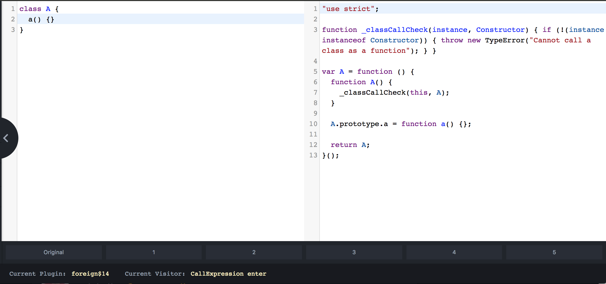

## 译：Babel 7 发布了（Part 2）

### 自动 Polyfilling（试验性的）
当运行环境不支持`Promise`，`Symbol`这些特性时，就需要使用 Polyfills 了。能够区分出 Babel 在作为编译器（用于语法转换）和作为 ployfill（用于实现内置方法/对象）都做了哪些事情，这点很重要。
在需要解决这些问题时，简单的办法是引入一套完整的库，比如`@babel/polyfill`：
```javascript
import "@babel/polyfill";
```
但是，这样就相当于引入了整个 polyfill，而对于浏览器已经支持的部分，是没有必要引入的。这其实和`@babel/preset-env`所解决的语法问题是一样的，所以可以把 `@babel/preset-env` 应用在解决 polyfill 的问题上。设置`@babel/preset-env`的参数`useBuiltins: "entry"`，将原本要引入的 ployfill 拆分成多个部分，然后引入可能需要的那几个部分（由此解决整个 ployfill 被引用的问题）。

事实上，更好的办法是我们只引用代码中实际需要的 polyfill 即可，我们尝试设置参数`useBuiltIns: "usage"`去解决这样的问题（[文档](https://babeljs.io/docs/en/babel-preset-env#usebuiltins)）(这时不需要手动引 polyfill )。
按照以上设置，Babel 在编译时会遍历每一个文件并查看其中是否有使用内置对象，并将对应的 polyfill 插入到代码中。例如：
```javascript
import "core-js/modules/es6.promise";
var a = new Promise();
```
目前这个接口还不是很完美，可能会存在一些误报的情况，如：
```javascript
import "core-js/modules/es7.array.includes";
a.includes // assume a is an []
```
*个人理解：这里 Babel 假定了`a`是一个数组，只引入了`core-js/modules/es7.array.includes`，但是 string 也会有`includes`方法，对应的`core-js/modules/es6.string.includes`却没有被引入。*

对于这种情况，还可以使用[polyfill.io](https://polyfill.io/v2/docs/)，如果你信任这样一个服务的话，你可以参考[Kent C.Dodds](https://twitter.com/kentcdodds)是如何使用这种方式[在 Paypal 上搭建托管服务](https://blog.kentcdodds.com/polyfill-as-needed-with-polyfill-service-35f0ff306a26)的。

### 其他

#### Babel 宏
Babel 的一大特点就是它的可插拔性。这些年来，Babel 已经从一个“6 to 5”的编译器转变成为了一个转换平台，为用户和开发人员带来了很多不可思议的优化方式。针对一些特殊的库和案例，已经开发了[许多 Babel 插件](https://www.npmjs.com/search?q=keywords%3Ababel%20plugin)，以用于提升库 API 的性能和功能。

不幸的是，想要在代码中添加这些插件，是需要修改配置的（许多工具并不允许修改配置，比方说`create-react-app`）。这种情况下，由于开发人员就必须知道他们使用的 Babel 插件会操作哪些文件且会产生怎样的影响，这样会增加了代码编写的复杂度。所幸的是，这些问题已经被[Kent C. Dodds](https://twitter.com/kentcdodds)所写的[babel-plugin-macros](https://github.com/kentcdodds/babel-plugin-macros)给解决了！

一旦`babel-plugin-macros`被安装并[添加到你的配置](https://github.com/kentcdodds/babel-plugin-macros/blob/master/other/docs/user.md)中（包括`create-react-app` V2），你就不用再担心如何配置就可以使用宏了。同时，为特定应用或代码[编写自定义转换](https://github.com/kentcdodds/babel-plugin-macros/blob/master/other/docs/author.md)也会变得更加容易。

预知更多关于`babel-plugin-macros`的详情，请参考[Zero-config code transformation with babel-plugin-macros](https://babeljs.io/blog/2017/09/11/zero-config-with-babel-macros)。

#### Module Targetting
Babel 一直尝试在转换之后的体积和提供给 JavaScript 用户的功能这两者之间做出平衡。在 Babel 7 中，通过配置 Babel 来支持[模块/非模块模式](https://github.com/kristoferbaxter/preset-env-modules) 变得更加简单了。
尤其是，一些流行的前端框架的 CLI 工具（[1](https://cli.vuejs.org/guide/browser-compatibility.html#modern-mode)，[2](https://github.com/developit/preact-cli/pull/583)）已经能支持模块/非模块模式了，这使得使用 Babel 编译后的 JavaScript 代码减少了大约 20%。

#### Caller Metadata and Better Defaults
我们已经在 `@babel/core`中添加了[caller 选项](https://github.com/babel/babel/pull/8485)，因此可以将 metadata 传递给 persets 或 plugins。例如，`babel-loader`可以添加配置参数 [supportsStaticESM](https://github.com/babel/babel-loader/pull/660)，使 `preset-env` 能够自动禁用转换模块（如 rollup 一样）。
```javascript
babel.transform("code;", {
  filename,
  presets: ["@babel/preset-env"],
  caller: {
    name: "babel-loader",
    supportsStaticESM: true,
  },
});
```
以上设置是真的很棒，因为它作为工具能够提供更好的默认值和更少的配置！对于 webpack/rollup 这种情况：我们可以自动使用自带的模块转换（与 `import('a')` 相同）。同时，我们也在寻找更多的工具，以便将来能更好地利用这一点！

#### `class C extends HTMLElement {}`
> 这是历史遗留问题之一，它如标题所述([详情](https://github.com/babel/babel/pull/7020))

在 Babel 不支持的情况下，如果使用类继承原生的内置接口（`Array`，`Error`，等）, 这时 Babel 会有警告。我们收到了很多关于这方面的问题 🎉，对于这种情况，现在的 Babel 7 已经支持了，也就是说可以使用 class 继承原生内置接口！

这个修改是针对 class 的插件，因此以上特性会在你使用 `preset-env`时自动启用。

#### 网站变更 🌏

Babel 的官网的平台由[Jekyll](https://jekyllrb.com/)变更为[Docusaurus](https://docusaurus.io/)！
我们仍在使用 [Crowdin](https://crowdin.com/project/babeljs) 去管理 Babel 的翻译（国际化），随着 Babel 的发布，我们将会使用一个更好的工具去完成这一部分。

#### REPL


我们已经将 [REPL](https://babeljs.io/repl) 重写为一个 [React 组件](https://github.com/babel/website/tree/master/js/repl)，并且与 [CodeSandbox](https://codesandbox.io/)能很好的集成。由此，你可以通过 [npm](https://www.npmjs.com/search?q=babel-plugin) 在 REPL 中安装任何插件或者 preset，并能即时获取到  [CodeSandbox](https://codesandbox.io/) 的任何更新。

我们再次参与了[Rails Girls Summer of Code ](https://railsgirlssummerofcode.org/)活动！与此同时， [Gyujin](https://twitter.com/MarinaGJCho) and [Sujin](https://twitter.com/sujinleeme) 已经将[Boopathi](https://twitter.com/heisenbugger)的[babel-time-travel](https://github.com/babel/babel-time-travel)集成到 REPL 中了，你现在可以试一试!


### 下一步计划
* Babel 本质上是与他编译的对象 JavaScript 联系在一起的，只要有新的建议或工作增加，就需要继续做下去，这包括在语法"稳定"之前，花费在这上面的时间和精力。我们关心着整个过程：升级的路径，新功能的引导教育，语言规范的教学，易用性以及与其它项目的集成。
	* 相关内容：感谢[Nicolò](https://twitter.com/NicoloRibaudo)，使得我们基本上已经完成了在 Babel 中实现新的 [decorators proposal](https://github.com/babel/babel/pull/7976)。正是因为新的 Babel 7 的开发是一个漫长的过程（它花了[一年多的时间](https://github.com/babel/babel/pull/6107#issue-135801160)），这个新的 Babel 与旧的版本完全不同也更加强大，大部分情况我们也在前面讲过了 🎉。敬请期待下一个小版本的发布（新的 decorators proposal ），同时也会有博文会对这些变化进行详细的解释。
* [Boopathi](https://twitter.com/heisenbugger) 已经努力地开发和维护着[babel-minify](https://github.com/babel/minify)，因此下一步我们将发布一个 1.0 版本。
* 还有一些新的特性正在进行中：插件排序，更好的校验/错误处理，速度，重新思考 loose/spec 模式，缓存，异步使用 Babel，在 CI 上直接构建，冒烟测试，运行 测试262。可以查看该 [roadmap](http://babeljs.io/docs/en/roadmap) 文档，去了解更多可能的 ideas！

我们没有需要保密的计划：我们在尽全力去为社区服务。

后面两章与技术无关，大家有兴趣自行阅读。

**相关信息**
* 原文地址：[Babel 7 Released](https://babeljs.io/blog/2018/08/27/7.0.0) 
* 译文出自：TWNTF
* 译者：Yuqing Xia
* 时间：2018.11.06