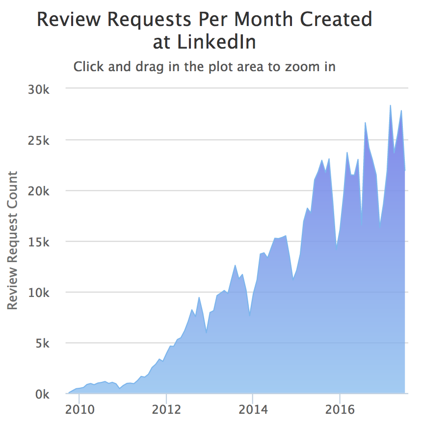

* 原文地址：https://thenewstack.io/linkedin-code-review/
* 译文出自：TWNTF
* 译者：wtzeng

# 来自领英的高效 code review 技巧

<i>领英最近在 code review 上达到了一个里程碑 - 一百万次 code review。社交网络服务的负责人对此分享了一些从中得到的经验。</i>

读代码和审查代码是一个软件工程师每天都要做的事。在代码被发布到生产环境前，一次正常的 code review 流程，通常需要团队的一些其他成员对这次代码提交的所有更改进行专业的审查。领英从2011年开始强制推行 code review ，使其成为我们开发过程中的一部分。我们引入 code review 的目的是尽量平滑地发展正在快速成长的工程师团队。有意义、有效的 code review 的确能很好地促进整个工程师团队的提升。在领英，code review 已经成为保证软件质量、分享知识的必要途径。拥抱 code review 也改变了我们的工程文化，在一些关键点上让我们做得更好。

实施公司范围的 code review 为我们带来最大的好处是开发流程的标准化。在领英的所有团队都使用相同的辅助工具集，并进行 code review，这意味着任何人都可以帮助另一个团队 review 他们的代码或者贡献自己的代码。这消除了"我能搞定他们的这个 bug，但我不清楚怎么编译代码还有怎么提交我的修复"之类的问题。这样就可以增加不同工程师团队之间的合作。

通过强制实施 code review，公司也形成了一个健康的反馈文化：工程师们以开放的心态给出或者接收任何方面的反馈，不仅仅止步于代码上，这已成为了我们日常工作的一部分。我们不是把 code review 当做批判和负面评价，而是把给出和接收 code review 作为一个能让自己变得更加专业的机会。事实上，高质量的 code review 是在领英晋升的重要因素，因为这提供了关于工程技能方面的客观证明。

在过去的几年中，我们探索出了几条 code review 的最佳实践，可以帮助你做出真正有用的 review。以下是一些以问题的形式提出的准则，我们建议互助来让 review 者和被 review 者都能得到最大的价值。

## 我是否明白"为什么"？

为了促成最好的 review 并且帮助你的团队前进，所有的代码变化在提交时都应该包含一个设计概述，简短地说明在这次改动背后的目的。如果我们要自己从代码本身的变化来推断出来这次变更的理由，那给出高质量的 review 就会变得非常困难。在尝试 code review 之前，请求并期望代码提交者说明他们提交的代码的目的是很合理的。这也鼓励了提交者在他们的提交信息中加上一些提交说明，从而可以增加代码文档的质量。

## 我是否给出过正面的反馈？

在一个都是聪明人的团队里，干净整洁的代码以及测试被认为是一件理所当然的事情。因此，code review 的反馈变得往往只关注于代码中发现的问题。这是非常不幸的，因为大部分人需要在正面的反馈中来获得参与感和动力 - 工程师们也不例外。当 review 代码的人在别人的代码中发现好的点时，他应该指出来并且给予正面的反馈。这有助于提高团队的动力，并且通常这样的正面反馈是具有传染性的，会传播开来。像写 code review 的评论一样(更多相关内容写在下面)，任何正面的反馈都应该是具体的，要解释为什么特定的代码是写得好的。

## 我的 code review 评论清晰明了吗？

无论是正面还是负面的反馈，任何 code review 的评论都应该是清晰明了的。在 review 者给的评论不够清晰明了时，接收到这条评论的工程师就可能无法清晰地理解意思。当有疑问存在时，充分的说明往往比简略的反馈更好，因为简略的反馈可能会产生更多的问题以及往复的沟通。说明可以写得简单明了，例如"减少重复"，"提升测试覆盖率"，或者是"让代码更容易测试"。除了让 review 的评论更加明了，这些类型的说明也有助于团队达到期望的设计原则。

## 我是否欣赏提交者的成果？

无论结果如何，困难的工作总是需要被欣赏的 - 这样可以培养强大的，高度积极的团队。一些提交的代码可能达不到较高的质量，并且需要重新修改。在这种情况下，重要的是也应该承认贡献者为此付出的努力，即使他们的代码需要修改。表达欣赏的最好方式是努力在 code review 时给出高质量的反馈以及合理的说明，欣赏代码中好的想法（在代码提交中，总是有闪光点的），并且对此表示认可。

## 这些 review  的评论对我有用吗？

通过这个问题，我们可以简单并有效地验证我们的 review 是否有效。在一天的工作快结束时，工程师应该把 code review 当作一种有用的开发辅助手段来实行，而不是将其作为无用的冗余工作。如果你认为某个 review 对你没有用，那么就不用太在意。典型的无益 review 的例子就是代码格式方面的，代码风格和格式应该由自动化工具来约束，不用工程师来费心关注。

## "testing done" 环节是否充分？

在领英，每一次代码更改的提交都有强制性的"tesing done"环节要填写。在开源世界里，用 Github 举例，工程师们可以在 PR 描述中提交"tesing done"的信息。"tesing done"中应该有什么，取决于这次变更的影响和当前的测试覆盖率。如果这次变更包含了新的或者基于条件的复杂度，那么这次变更需要增加单元测试。如果集成测试不够充分的话，有些变更可能需要运行手动测试。在那些情况下，"tesing done"应该包含测试场景和输出的信息。当这次变更改变了程序的输出时，把新的输出写进"tesing done"部分是非常有用的。

## 我是不是太讲究了？

有些 code review 包含了大量的评论，于是在大量的不重要的建议中，一些真正需要被修复的重要的问题可能就被忽视了。Review 如果过分地关注细节的话，既会降低团队 review 的速度，还可能会在团队成员之间产生摩擦。为了避免产生冗长的、耗尽精力的 review，清晰明了的 review 期望、用事例来描述 review，积极有吸引力的 review 文化都是好的解决方法。

总的来说，正确的 code review 过程可以有效改善代码质量，促进团队成长和知识共享。如果团队里的每个工程师都有这个意识："有人会来读我的代码，所以我还是写好一点好。而且我还得处理我收到的每一个 review 评论，所以我应该尽量在第一次提交的时候就让代码好一点，以避免后面还要投入精力"，那么大家工作的质量都能变得更高。当 code review 变成每天的习惯时，团队就会在日常去给予和接收反馈，这是成长和改善的关键。

在领英，我们从过去的一百万次 code review 中学到了很多东西，并且我们期待在下一个一百万到来时学到更多东西。团队成员在 code review 中越用心，就能在 code review 时做得越好，从而代码的质量越来越高，产品的质量也越来越好。高质量的 code review 是会传染的哦！

<i>非常感谢 James Miller，Oscar Bonilla，Joshua Olson，Andrew Macleod，Scott Meyer 和 Deep Majumder 对这篇文章给予的反馈。</i>