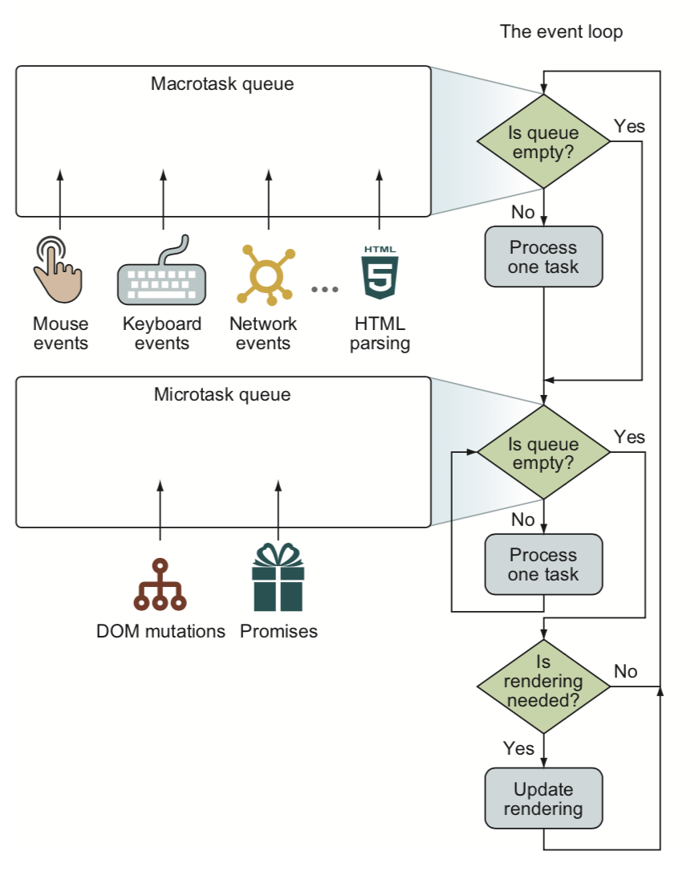
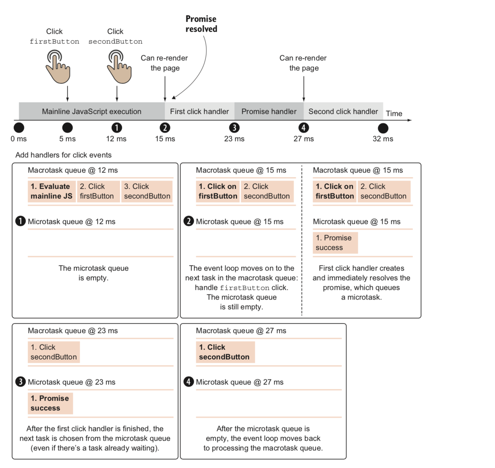

# 深入理解 Javascript 事件模型

最近在看[《Secrets of the JavaScript Ninja, Second Edition》](https://www.manning.com/books/secrets-of-the-javascript-ninja-second-edition)这本书，看到第十三章"Surviving Events"觉得写得非常好，所以在这里提炼总结一下，文中还穿插了自己的一些理解。

在一个页面的生命周期中，主要分为两个阶段:

1. Page building
2. Event handling

Page building 阶段发生在刚打开页面时，浏览器会解析 HTML 形成 DOM 并执行初始的 JS 代码。在 Page building 完成后，就到了 Event handling 阶段，在这个阶段中，当一个事件发生时，这个事件对应的处理函数就会被添加到任务队列中，浏览器会一直循环地检查是否有任务需要处理，有的话就进行处理。这个响应事件，处理事件的模型我们把它叫做事件处理模型，这个过程就叫做 **Event loop**。

## Event loop

Event loop 给我们带来的好处是，这个机制确保了代码的非阻塞执行，不会因为某个任务正在执行，就无法响应其它事件，从而使页面卡成PPT，当然代码写不好也会让页面卡成PPT（逃。

现在，我们通过流程图来看一下 event loop 的详细过程:



先忽略图中的 macrotask queue 和 microtask queue，把他们合起来当作一个大的任务队列，再看右边流程的主要步骤，可以看出在一次 event loop 循环中大体的步骤是：**当页面渲染完成后，浏览器会去检查任务队列中是否有任务需要执行，如果有就执行，接着去判断页面是否需要重新渲染，需要就重新渲染，然后就进入下一次 event loop 循环**。在这个持续的循环过程中，不断有新的任务随着事件的发生而推到任务队列里，然后在 event loop 循环中被处理执行。

理解了上述 event loop 的过程后，我们再来看看刚才忽略掉的 macrotask queue 和 microtask queue。

## Macrotask 和 Microtask

在异步事件模型中，我们已经知道了有一个任务队列。当某个事件发生时，如果有相应的回调函数，就会把这个函数添加到任务队列中，等到主线代码执行完毕了，就会循环检查和执行任务队列里的任务。

但是事件是分类别的，比如 UI 交互事件、网络事件、定时器还有 promise 等等，这些事件的重量级(成本和影响)是不一样的，它们设计出来的目的也不一样，因此，浏览器对不同类别的事件进行了分化的处理，并把它们分入到了两个更细微的任务队列中：分别是 **macrotasks(有时也直接叫作 tasks )** 队列和 **microtasks** 队列。

* 在 macrotasks 队列中，主要处理 UI 交互事件、网络事件、定时器和 HTML 解析任务。从浏览器的层面来说，一个 macrotask 表示一个独立的任务，在执行完这个任务后，浏览器可以进行下一项独立任务，例如 re-rendering 或者垃圾回收。

* 而在 microtasks 队列中，主要处理 promises 和 DOM mutation。microtask 相对于 macrotask 来说更轻量级，它的目标就是在 re-rendering 之前把所有的页面状态改变都准备好，因此在一次 event loop 循环中，会尽可能多地把所有现有的 microtasks 都处理掉。

从这种分类的结果来看，我们可以看出 macrotask 队列中的事件之所以被认为是更重量级的事件，并在 microtask 之前得到执行，是因为这些事件大多是异步任务产生的"始作俑者"，比如是因为点击了鼠标或者发生了网络请求，才需要进行一系列响应和处理，并得到最终的结果，它们是相对独立、完整的任务。而 microtask 队列中的事件，更像是一个微小的任务，作为伴生品为其它更大的意图进行服务，比如 promise 可能是对网络请求的过程进行的操作封装，microtask 单独存在的话就显得缺乏意义。这是我对这种分类方式的理解。

基于上述理解，既然 microtask 只是做了一些微小的工作（误），那么它们的出现往往意味着有更"重量级"的事件作为产生这些"微小工作"的原因，因此，这些 microtasks 就变得迫切需要执行，才能更好地服务于"大事件"。因此，在一次 event loop 循环中出现的 microtasks，都是应该 ASAP 滴执行的。

现在，再回到上面 event loop 的图中，完整走一遍整个流程: **当页面渲染完成后，浏览器会去检查 macrotask 队列中是否有任务需要执行，如果有就执行排在最前面的那个，再去检查 microtask 队列中是否有任务需要执行，有就按顺序一个个地把 microtask 全部执行完，接着去判断页面是否需要重新渲染，需要就重新渲染，然后就进入下一次 event loop 循环**。

## 事件响应是安排任务，而非执行任务

理解了上面的 event loop 后，这句话就很好理解了，事件响应并不是当事件发生的时候，事件对应的回调函数就立刻得到执行，而是立刻得到"安排"，这些响应函数被明明白白地安排进了任务队列(macrotasks queue 或 microtasks queue)中，静悄悄地等待着 event loop 的到来，等排到它的时候才开始它的表演。

---

结合一个具体的例子来阐述一下上面所述的所有东西:

HTML:

```HTML
<button type="button" id="firstButton">first button</button>
<button type="button" id="secondButton">second button</button>
```

Javascript:

```Javascript
const firstButton = document.getElementById("firstButton")
const secondButton = document.getElementById("secondButton")

firstButton.addEventListener("click", function firstHandler(){
  Promise.resolve().then(() => {
    /*promise 处理代码，需要花费 4ms 执行时间*/
  })
  /*点击事件处理代码，需要花费 8ms 执行时间*/
})
secondButton.addEventListener("click", function secondHandler(){
  /*点击事件处理代码，需要花费 5ms 执行时间*/
})
/*主线代码，需要花费 15ms 执行时间*/
```

上面这段代码，我们假设主线代码执行完需要 15ms，promise 执行完需要 4ms，firstButton 的响应函数执行完需要 8ms，secondButton 的响应函数执行完需要 5ms。

现在假设有一个用户手非常快，在代码开始开始执行的第 5ms 就点击了 firstButton，在第 12ms  就点击了 secondButton。我们来看看在这种情况下 timeline 中的代码执行会是怎样的:



1. 在 12ms 时刻，主线代码还在执行，此时 firstButton 和 secondButton 的点击事件响应任务已经被推入到了 macrotask queue 中（安排任务，而非执行任务）
2. 在 15ms 时刻，主线代码执行完毕，macrotask queue 中还有 firstButton 的点击事件的响应任务和 secondButton 的点击事件响应任务
3. 在 15ms 的下一个瞬间，promise 的状态变为 resolved，一个 promise resolve 的处理函数添加到 microtask queue 中
4. 在 23ms 时刻，firstButton 的点击事件响应任务执行完毕，此时 microtask queue 中有一个 promise 处理函数等待执行，因此先执行这个 promise 处理函数（虽然 promise 处理函数比 secondButton 的点击事件响应任务更晚添加到任务队列中，但由于它是在这一轮 event loop 里被添加到 microtask queue 中的，能立刻被检查到，因此更先得到执行，符合上述说的原则）
5. 在 27ms 时刻，promise 处理函数执行完毕，一轮 event loop 完成，检查是否需要重新渲染，需要则重新渲染，然后进入下一轮 event loop
6. 在 27ms 的下一个瞬间，macrotask queue 中还有 secondButton 的点击事件处理任务，进行执行，直到 32ms 时刻执行完毕

上面这个实际的例子，就完整而具体展现了 event loop、macrotask queue、microtask queue 以及"事件响应是安排任务，而非执行"这些点。

> *补充:*

这里有一个可以深入思考的点，就是在 5ms，12ms 时刻，我们怎么保证两个按钮对应的点击事件回调函数都注册好了呢？明明这时候主线代码还在执行，我们并不清楚两个 `addEventListener` 是否都执行完毕了。那为什么在主线代码执行完毕以后，我们就能确保回调函数的执行呢？其实这里我也试图查了下 W3C 的资料，但是没有查到，因此试着用代码去验证了一下：当事件回调函数"正在注册"时，产生相应的事件是否会触发那个"正在注册"的回调函数的执行，以下为实验代码:

```Javascript
const $0 = document.getElementById('most-visited') // 准备一个元素用于产生点击事件

// 准备一个 sleep 函数来占用线程
function sleep(delay) {
  var start = (new Date()).getTime();
  while ((new Date()).getTime() - start < delay) {
    continue;
  }
}

// 事件处理函数
const handler = () => console.log('I\'m clicked!')

// 添加事件处理函数
function addHandler() {
  sleep(5000);
  $0.addEventListener('click', handler)
}

setTimeout(addHandler, 0) // 点击①: 执行后立刻在 5 秒钟之内快速点击 1 次 $0 元素

// I'm clicked!
```

之后，

```Javascript
function removeHandler() {
  sleep(5000)
  $0.removeEventListener('click', handler)
}

setTimeout(removeHandler, 0) // 点击②: 执行后立刻在 5 秒钟之内快速点击 1 次 $0 元素

```

在点击①发生后，console 里面输出了 `I'm clicked!`，这说明在代码执行的那 5 秒钟里，点击行为产生了作用，这个"正在注册"的点击事件响应函数得到了执行；

在点击②发生后，console 里面没有输出 `I'm clicked!`，这说明在代码执行的那 5 秒钟里，点击行为并没有造成响应函数的执行。

从这里我们可以推断出，在主线程执行或者一次 event loop 循环的过程中，发生的事件（不包括代码产生的，例如 dispatchEvent 产生的事件不算，有测试过）会马上被浏览器记录，但事件对应的回调函数会在同步代码执行完以后才确定并得到执行。

## 定时器 setTimeout 和 setInterval

Javascript 初学者可能会认为这两个函数的作用分别是"指定时间延迟后执行某函数"和"每隔指定的时间间隔执行某函数"，**但这种观点是不准确的，实际它们的作用应该理解为"指定时间后添加一个定时任务的响应函数到任务队列(macrotask queue)中"和"每隔指定时间间隔添加一个定时任务响应函数到任务队列(macrotask queue)"**。上面已经花了大篇幅说明了添加到任务队列中意味着"安排"而非"执行"，因此这里就不再赘述了。

定时器 setTimeout 和 setInterval 有几处可以深入的地方:

### 周期性 setTimeout 和 setInterval 的区别

乍看之下，setInterval 和周期性地执行 setTimeout 没什么区别，但是深挖之下他们是有区别的，看如下代码:

```Javascript
setTimeout(function repeatMe(){
  /* 代码块... */
  setTimeout(repeatMe, 10);
}, 10)

setInterval(() => {
  /* 代码块... */
}, 10)
```

相信聪明的你一看到代码就已经想到了，递归 `setTimeout` 的方式至少需要 10ms 才添加一个定时器任务，因为代码块的执行还需要时间，在代码块执行完后的 10ms，才进入下一轮递归。而 `setInterval` 是真正的每隔 10ms 就添加一个定时器任务。要成为高手，这种细节不可忽略。

虽然递归 `setTimeout` 的方式不是那么精确，但是大部分场景下我们的要求没有那么高，因此上面那种方法也可以为我们带来一些好处，方便地解决一些问题。例如我们想实现一个"倒计时 60s"的功能:

```Javascript
setTimeout(function foo(i) {
  console.log(`Remaining ${i} ${i > 1 ? 'seconds' : 'second'}`) // 可以在这里利用 i mutate 应用的状态
  if (i > 0) {
    setTimeout(foo, 1000, --i)
  }
}, 1000, 60)
```

这样递归 `setTimeout` 为我们带来的好处是计时的状态可以不用借助外部变量，内部就可以利用尾递归来保存，代码简单明晰。如果用 `setInterval`，不借助外部变量是做不到的。

### 只能同时保持一个特定的 setInterval 的定时器任务

`setInterval` 是周期性间隔地在 macrotask queue 中添加定时器任务，但是并不是每一次添加都会成功，因为 macrotask queue 中只会同时保持一个特定的 setInterval 的定时器任务。

举个例子，假设主线代码需要花 50ms 才能执行完，有一个 `setInterval` 每隔 5ms 就添加一个定时任务，那么到 50ms 时刻，理论上已经有 10 个对应的定时器任务在队列中了，但实际情况是只有第一个添加的那个，其余 9 个都会被浏览器抛掉。直到这一个定时器任务开始执行了(不要求执行完)，才会添加下一个周期性的定时器任务。

### 进阶技巧: 利用定时器优化大量计算

这个技巧听起来很强大，也许很高级，但是理解了上面的 event loop 就很简单了。因此这里我也决定不写代码，只用叙(偷)述(一)说(个)明(懒)就好。

举个极端点的例子，假设我们要添加一个表格到页面中，这个表格有 10k 行，最直接的做法是准备好表格以及 10k 行表格行以后，一次性添加到页面中。这样会造成一个问题，因为 10k 行的表格需要计算很久才能得到，这段时间内因为 JS 代码在同步执行，会造成页面有"假死"的现象，给用户的感觉是页面突然之间卡了很久，然后突然出现了一个表格。

这种体验是不好的，那么我们怎么优化它呢？基本的思路是，将这个大块的渲染过程拆成几个小块的渲染过程，分段计算和渲染，这样虽然可能花得总时间更多，但是给用户的感觉是在更短的等待时间内逐步出现了表格的内容，有更加流畅的感觉。（很有趣的思路，产生了更多的代码执行过程却带来了流畅的感觉）

所以思路就是分段计算和渲染，那么结合上面的 event loop 的图来看，什么时候会渲染呢？在每一次 event loop 循环的最后都有 re-rendering。这就好办了，利用 setTimeout 分成 4 段来计算和渲染表格就好了，这样就会产生 4 次 event loop，以下是大致的代码:

```Javascript
setTimeout(function foo(i) {
  if (i > 0) {
    console.log(`This is part ${i}`) // i 代表过程中的第几段
    // 根据 i 来执行添加表格的操作
    setTimeout(foo, 0, --i)
  }
}, 0, 4)
```

偷懒地将上面倒计时的代码拷下来稍作改动就 OK 了(￣▽￣)~*，吼不吼

## DOM 事件

### 捕获和冒泡

一个 DOM 事件流分为捕获和冒泡两个阶段:

* 捕获阶段: 事件先被顶层元素(window)捕获，然后慢慢向下传递到目标元素
* 冒泡阶段: 事件到达目标元素后，再从目标元素开始向上进行冒泡，直到顶层元素

因此，当我们用 `addEvenetListener(type: String, handler: Function, useCapture: Boolean)` 向一个目标绑定事件处理函数时，需要指定事件响应的阶段，如果第三个参数未传递，则默认为 `false`，处理函数在冒泡阶段执行。

为什么要设计这两个阶段呢？我认为两个阶段各有其用处，比如在冒泡阶段处理的事件，当我们只希望在后代元素触发事件，而不在祖先元素上触发相同事件时，调用事件对象的 `stopPropagation()` 方法即可；而对于捕获阶段处理的事件，我们是阻止不了目标元素的上层元素对事件的捕获的，在实现类似"点击当前区域之外的区域就收起本区域"的功能时，为根元素或较顶层的元素(如 document.body)在事件捕获阶段添加事件处理函数就是很有效的。

### 事件处理函数中的 this

当我们用 `addEventListener` 为某个目标添加事件处理函数时，如果写的是 `function` 声明的函数，则在事件处理函数的内部，`this` 指向事件处理函数注册的目标元素。例如:

```Javascript
document.body.addEventListener('click', function(e) {
  console.log(this === document.body) // true
})
```

其实除了上述的 `this` 指向目标元素外，事件对象的 `currentTargert` 属性也指向目标元素自身，而事件对象的 `target` 属性则指向触发事件的元素。

### 事件委托

当我们需要为大量同类的后代元素绑定时间处理器时，可以将事件处理器绑定在他们共同的祖先元素上，采用"事件委托"的方式来处理，然后只要在事件处理函数中判断触发事件的来源就可以了。例如:

```Javascript
const table = document.getElementById('someTable')
table.addEventListener('click', function(event){
  if (event.target.tagName.toLowerCase() === 'td')
    // 代码块
})
```

这样就把所有点击 `<td>` 的事件处理函数只委托在 `<table>` 上绑定一次就好了，让代码更加简洁、优雅的同时也提升了代码的性能。

## 自定义事件

想象一个场景，你有一个通用性比较高的操作，需要在各种各样的条件下执行。对一个新手来说，他可能会在每一个触发条件处写一遍操作代码；对一个熟手来说，他可能会创建一个全局共享的函数，在所有触发的条件处调用这个函数；而对一个老鸟来说，他会采用自定义事件，为什么呢？

我们先假设一个更复杂的情况，不止触发这个操作的条件多种多样，这个操作本身也由很多个部分构成，这样的话在每一处触发条件下，我们都必须密切地关心这个条件具体会执行哪些操作才能避免出错。这种情况就属于**紧耦合**，代码之间密切关联在了一起，如果是本身就比较复杂的代码的耦合，代码将会变得难以编写、阅读、维护和调试。

因此，我们需要一种**松耦合**的模式，于是自定义事件就排上了用场。采用自定义事件，触发事件的条件处只用关心自己的触发行为，不用关心这个事件具体会触发什么操作，甚至不用关心这个事件是否会触发操作。而在执行操作的地方，只需注册相应的事件处理函数即可，不用关心怎么去触发。这样这两处的耦合就被解开了，代码变得更好编写、阅读、维护和调试。

来看一个"AJAX 动画"的例子: 我们模拟执行一个 AJAX 操作，由于完成需要一定的时间，为了让用户在等待请求完成的过程中得到更好的体验，我们会展示一个加载动画，直到请求完成，再隐藏这个加载动画，利用自定义事件可以这么做:

HTML:

```HTML
<style>
  #whirlyThing {
    display: none;
  }
</style>
<button type="button" id="clickMe">Start</button>

```

Javascript:

```Javascript
function triggerEvent(target, eventType, eventDetail){
  const event = new CustomEvent(eventType, {
    detail: eventDetail
  })
  target.dispatchEvent(event)
}

functionperformAjaxOperation(){
  triggerEvent(document, 'ajax-start', { url: 'my-url'})
  setTimeout(() => {
    triggerEvent(document, 'ajax-complete')
  }, 5000)
}

const button = document.getElementById('clickMe')
button.addEventListener('click', () => {
  performAjaxOperation()
})

document.addEventListener('ajax-start', e => {
  document.getElementById('whirlyThing').style.display = 'inline-block'
})

document.addEventListener('ajax-complete', e => {
  document.getElementById('whirlyThing').style.display = 'none'
}）
```

通过利用自定义事件 `CustomEvent`，我们完成了更加解耦的实现。"执行 AJAX 的函数"和处理动画的函数不再紧密关联在一起，它们可以拆分到各自的模块中，模块化地处理之后，代码变得的更易于书写、阅读和调试。

## 总结

以上就是 Javascript 事件模型中的主要内容。我们来做一个总结:

1. 在页面的 event handling 阶段会持续进行 **event loop**，不断地从任务队列中读取任务并执行，然后按需重新渲染页面；
2. event loop 的任务队列包含 **macrotasks queue** 和 **microtasks queue** 两个队列，它们分别处理"重量级"的事件和"轻量级"的事件；
3. 事件响应是把事件的处理函数添加到任务列表中，而不是立刻执行；
4. 周期性 setTimeout 和 setInterval 有区别；
5. 定时器可以用于性能优化，将大型任务分段执行、渲染；
6. DOM 事件流分为捕获阶段和冒泡阶段；
7. 利用自定义事件可以解耦复杂的操作触发场景。