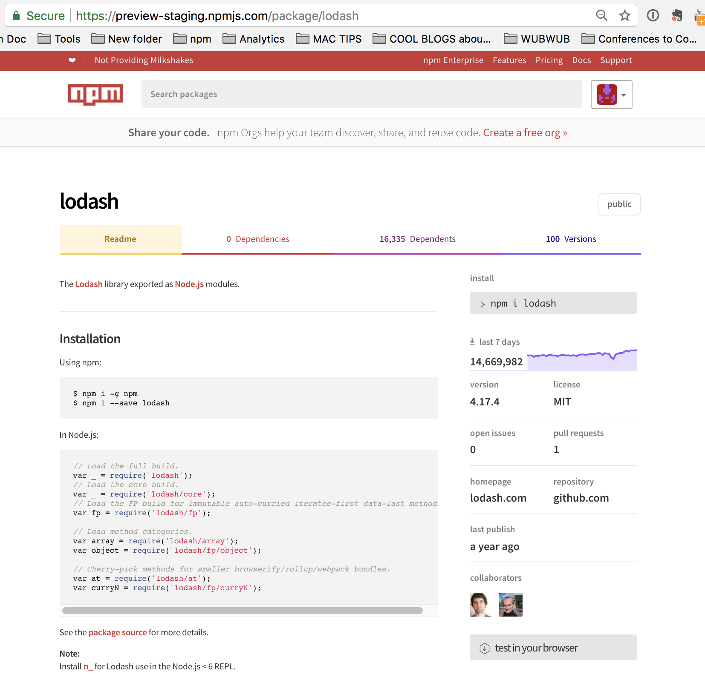

## 译：如何创建和发布Node.js modules

**译者注**：npm官方网站提供的文档比较简单和零散，这里我结合自己的理解，把module的发布以及本地创建整合到一起进行翻译，更利于理解。

Node.js modules就是一种会在npm上发布的第三方包，也就是我们会通过npm引用的他人编写的第三方包。创建一个新的module从生成一个`package.json`文件开始。

### 本地创建

#### 配置文件package.json

首先，使用`npm init`	创建`package.json`文件，创建开始会提示你并完成一些参数的初始化。需要注意的两个参数是`name`和`version`，再就是参数`main`，你可是使用默认值，也就是`index.js`，也可以自己定义。下面是关于这些`package.json`中参数的[详细介绍](https://docs.npmjs.com/getting-started/using-a-package.json)。

>**必要参数**
+ name
	+ 必须为小写
	+ 一个单词，不含空格
	+ 允许使用连字符(-)和下划线(_)
+ version
	+ 遵循格式`x.x.x`
	+ 按照预定的[版本语义规范](https://docs.npmjs.com/getting-started/using-a-package.json)

例如：
```json
{
  "name": "my-awesome-package",
  "version": "1.0.0"
}
```
>**其他参数**
+ description： 描述信息，可以为空
+ main：入口文件，默认为`index.js`
+ scripts:  包的一些命令行脚本 
+ keywords：包关键词，用于在npm服务器上显示和检索
+ git repository：包对应的Git仓库
+ author
+ license

如果你需要`package.json`中说明`author`信息，需要按照如下的格式，其中`eamil`和`website`是可选项：
```
Name <email@example.com> (http://example.com)
```

#### 入口文件

完成`package.json`的创建后，接下来，我们需要创建入口文件，也就是我们的module在被`require`引用时对应的文件，一般默认为`index.js`。在该文件中，添加一个简单的function，并export出来，这样以供访问。
```javascript
exports.printMsg = function() {
  console.log("This is a message from the demo package");
}
```
 完成以上两步，本地配置就已经宣告结束了，下面我们来讲如何讲本地的package发布到npm服务器上。

### Module发布

你可以发布任何包含了`package.json`的工程目录，这一小节将会详细介绍如何完成第一次发布以及后续的更新工作。
#### 准备工作

+ **理解npm的规范**
在开始之前，我们最好能先对npm的[规范规则](https://www.npmjs.com/policies)有一个初步的了解，包括规范，许可证明，命名要求，或者其他一些问题。
  
+ **账号创建**
想要在官网上发布npm包，你必须在官网上注册一个账号，另外你也可以通过命令`npm adduser`进行注册。完成注册后，通过命令`npm login`在终端登录你的账号即可。
**验证**
1. 通过`npm whoami`去验证是否在终端成功登录，同时，意味着你的`credentials` 也在本地保存好了；
2. 通过访问如下形式的URL https://www.npmjs.com/~username去官网查看你的主页，例如：https://www.npmjs.com/~carolynawombat。

#### 回顾检查

+ 检查内容
需要注意的是发布到npm时，package目录下所有文件将会被上传，如果一些文件需要排除在外的话，这就需要使用`.gitignore`或者`.npmignore`去进行管理，更多相关命令可以参考[keeping files out od your package](https://docs.npmjs.com/misc/developers#keeping-files-out-of-your-package)。

+ 检查`package.json`文件
参考上面提到过的[`package.json`中参数的详细介绍](https://docs.npmjs.com/getting-started/using-a-package.json)， 根据文档与你的`package.json`进行一一对应。

+ 起个名字
给你的package取一个独一无二的名字，遵循以下规则：
	+ 不能使他人已有的名字；
	+ 除非是拼写错误，不要与其他名字相似；
	+ 对于作者信息，需要明确，不能具有误导性；
	+ 参考npm的[规范规则](https://www.npmjs.com/policies)，例如：命名不能包含攻击性含义，请勿使用他人已注册的商标；
	+ 在`package.json`文件中添加包名。
	**注意**：当你使用了[scopes](https://docs.npmjs.com/misc/scope)时，可以忽略前三条规则。

+ 添加说明文档（readme.md）
npm官方推荐在package中添加说明文档，这个说明文档必须命名为`readme.md`，其中扩展名`md`表明这是*markdown*文件。这个文档也将会被展示在你发布的package对应的页面中。
在你开始编写说明文档之前，请参考npm上已经发布的package的说明展示页面，一方面能给你提供书写灵感，另一方面能够体验到说明文档的重要性。
	1. 用任意文本编辑器编写说明文档；
	2. 保存在工程根目录中，命名为`readme.md`;
	3. 当你完成发布，说明文档将会展示在package的下载页面。

#### 发布

上述准备好后，使用`npm publish`就可以发布你自己的package啦。

#### 验证

发布完成后，我们可以通过访问`https://npmjs.com/package/<package>`	这种形式的URL，打开你发布的package的主页，如果类似于下图，恭喜你完成了第三方包发布的全部流程：


接下来，我们可以在另外的工程中引入我们创建的package去做进一个验证，确保能正确被引入并使用。
+ `npm install <package>`
+ 引入并调用，验证是否为对应的`console.log`输出。
```javascript
const test = require('package');
test.showMsg();
```

**相关信息**
* 原文地址：
[How to Create Node.js Modules](https://docs.npmjs.com/getting-started/creating-node-modules)
[How to Publish & Update a Package](https://docs.npmjs.com/getting-started/publishing-npm-packages)
* 译文出自：TWNTF
* 译者：Yuqing Xia