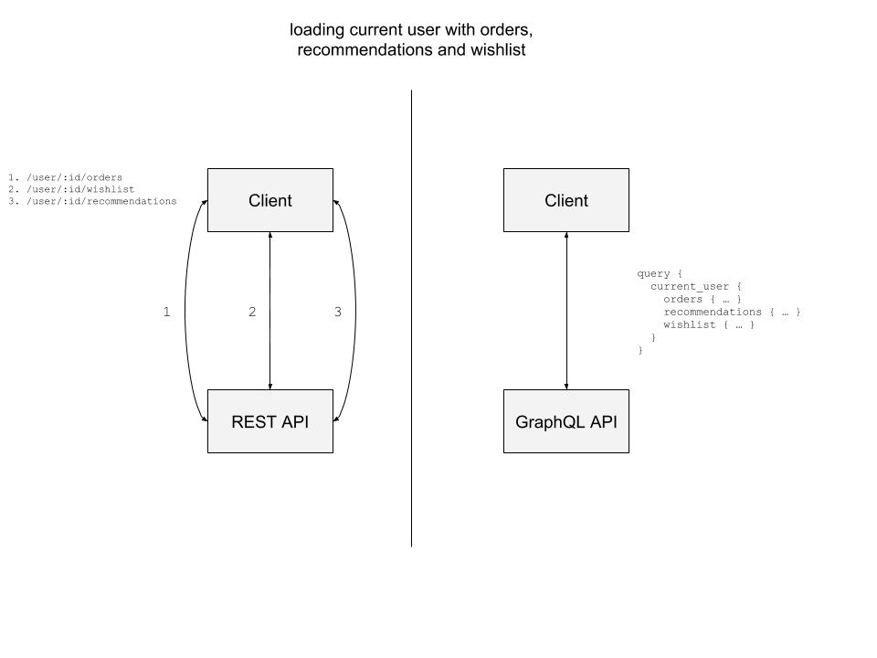
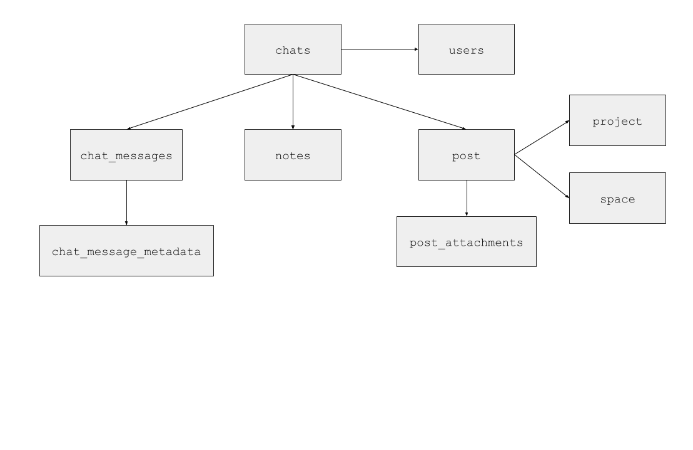
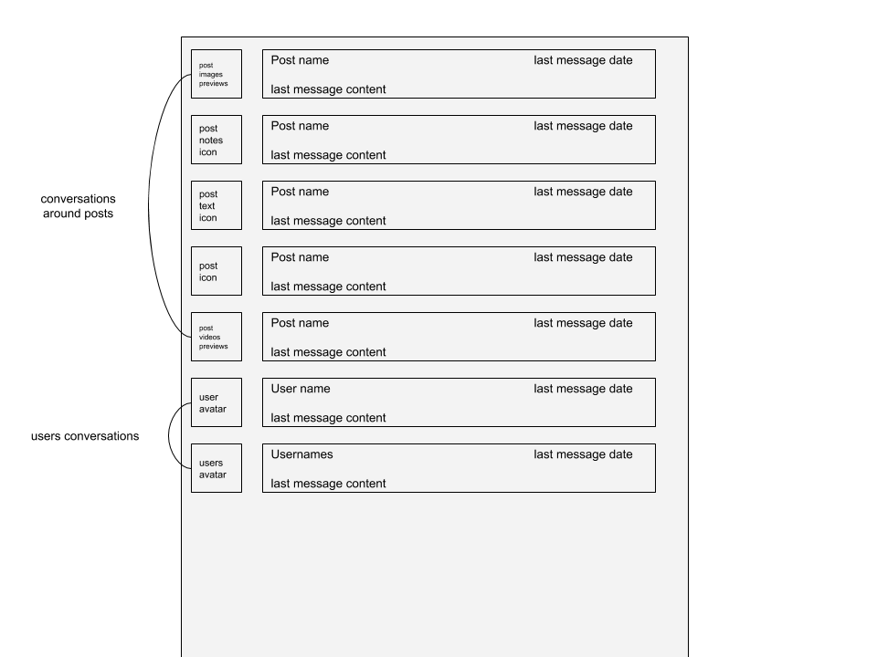
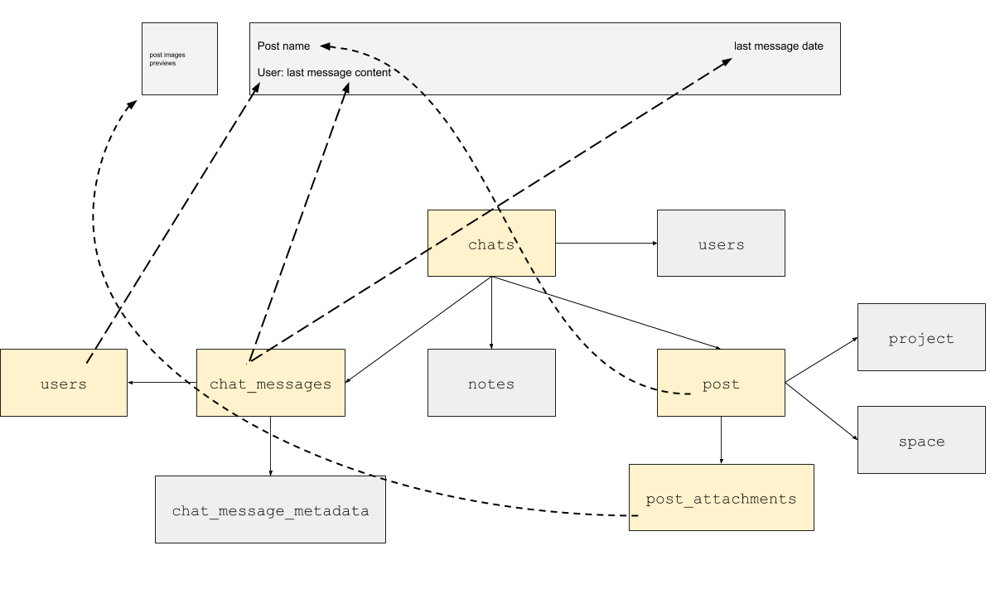

* 原文地址：https://honest.engineering/posts/why-use-graphql-good-and-bad-reasons
* 译文出自：TWNTF
* 译者：wtzeng

# 为什么要用 GraphQL，好的和不好的使用理由

老实说，GraphQL 最近几个月都在大肆宣传。

从独立开发者到 [Prisma](https://www.graph.cool/)、[Apollo](https://www.apollographql.com/engine/) 甚至 [Amazon](https://aws.amazon.com/fr/appsync/) 之类的商业公司都开始用它提供专业的产品服务和支持。

就像 [Typescript](https://itnext.io/why-use-typescript-good-and-bad-reasons-ccd807b292fb) 或任何其它新技术一样，我们都会思考这一个问题：

> 我应该用这项技术吗？我需要它吗？

如果你对 GraphQL 也有这样的疑问，那么这篇文章值得你一览。

## 不好的使用理由

### （认为）GraphQL 是一种大势所趋的酷技术

经验丰富的开发者知道一件事，那就是不因为别人都用某项技术，自己就用某项技术。

每项技术都有它特定的用途以及解决特定的一个或多个问题。

对于 GraphQL 来说，它在工程项目中的主要目标是提供“一种 API 查询语言”。特别是允许客户端指定哪部分数据是他们需要的。

因为移动端的带宽和网速限制，这对移动端的应用来说很有用。

你将在下面的“缺点”章节看到，这个酷酷的 GraphQL 并不能解决所有的问题，无论是在前端还是移动端。

### （认为）GraphQL 可以解决所有的性能问题

对于客户端而言，开箱即用的 GraphQL API（服务器）实现将具有比标准 REST API 更好的性能。

由于解析器是并行调用的，因此数据加载速度更快。

但是，如果没有解析器优化，如 joins，批处理系统，性能提升就不会那么明显了 - 特别是在 pool 很小的关系型数据库中。

解析器的性能优化可能会很复杂，因为它取决于你的 API 怎么使用。

像 [Apollo Engine](https://www.apollographql.com/engine) 这样的专业工具也许可以帮你识别出性能瓶颈或者是 API 的最高频使用字段，但请记住，GraphQL 不能像魔法一样地帮你提升性能。

### （认为）GraphQL 是新的 REST

GraphQL 和 REST 是两种不同的东西，GraphQL 是一种语言和技术，而 REST 是一种架构模式。

由于它们引入了两种不同的解决方案，因此它们是可以互补的，简单来说：

> GraphQL 并不会终结 REST

尽管 GraphQL 在解决复杂的数据交换问题时很有用，但在简单或者标准的使用场景中，它就太“工程化”了。

例如，在一些微服务或者非面向用户的 API 场景下，比如为商业智能或者其它一些目的提供数据的 API 中，没有必要使用重量级的 GraphQL - 毕竟 REST 只是具有约定的 HTTP，实现和用起来都会比 GraphQL 简单。

我们将在下面的“缺点”章节看到，GraphQL 在 JavaScript 以外的生态系统中存在感并不强。(注：本来此处还有句可能有错的原文没翻译)

首先，GraphQL 需要向 API 发送 JSON 以便获取数据。

这看起来有点麻烦。因此在客户端使用 GraphQL 时通常都会借助一些专用的库来解决语言复杂性的问题 - 这也是为什么我们一般都说 Apollo GraphQL 而不是直接说 GraphQL。

这也是为什么在考虑到 REST 的简易性下，你需要确定 GraphQL 是不是能解决你的问题（这是否值得）。

其次，如上面的第二点所述，GraphQL API 服务器需要优化和维护。

使用 GraphQL 向的方式从 SQL 类数据库里取数据会有些 tricky。

并且，它让客户端使用起来更加方便了，也就直接把更多的责任交给了服务端。

现在，服务端必须要处理客户端发来的数据查询请求并应对其中的复杂问题。

最后，GraphQL 是在 JavaScript 生态系统中诞生的。

在 JavaScript 生态之外使用 GraphQL，你将会感到开发体验的损失。让我们用 Ruby 来举例说明。

即使有许多人通过维护 graphql-ruby 和 graphql-client 参与到 GraphQL 的 Ruby 实现中，这里面也会涉及到线程使用和非常声明式的语法（基于类和模块） - 你对 Ruby 中的线程安全编程熟悉吗？

即使在其它语言或者生态中，GraphQL 的优势还是在于 JavaScript 中，尤其是在 Apollo 项目中。

## 好的使用理由

### 移动端优先的用户体验

毫无疑问，GraphQL 是移动端富交互应用开发的游戏规则改变者。

忘了“全家桶”式的做法以及预加载 REST，然后享受 GraphQL 带来的力量吧。让我们来看看：

### GraphQL 可以帮你处理复杂的 Schema

#### 对用户界面来说

你的应用是基于使用了大量嵌套 model 和关联的 Schema 的吗？

你的设计师是否提供了一个复杂的 UI，并在一个区域展示所有的数据？

由于现在的 UI 应用变得越来越复杂，富交互的体验使用了远超 REST 的 CRUD 的API 所能提供的数据形式，GraphQL 就变成了一个走向领域驱动 API 的不错的解决方案。

通过领域驱动 API，我们建立了一些 API，能产生服务于用途（像计算值，铺平关系）的数据 Schema。

就像下面这个 chat model 中的例子一样：

主要地看，一个 chat 可以是：

* 单聊
* 群聊
* 关于一个帖子（图片、视频或者笔记）的对话

让我们思考以下这个相关的 UI 草图：

现在你可以简单地意识到，通过 REST API 来开发和维护这种类型的组件，尤其是实时组件的话是很困难的。因为你必须处理许多的数据关联问题，这包含最多三个嵌套层级。

#### 对 server 到 server 端来说

这个例子在 ”server 到 server “端也是成立的。

GraphQL 不仅只在前端，它也可以被用于”server 到 server“的场景。

看这个[Github Awards](http://git-awards.com/)网站，它通过仓库的 star 数量来给用户排名。

这个网站必须取得所有用户仓库的 star 数，这个功能用 REST 也是可以做的。

但是，假设维护者想像下面那样改变排名的公式：

* 使用 follower 用户的数量
* 所有仓库的 forks 数量
* 包括用户所属组织的仓库

那么，用 REST 就变得很困难了。

幸运的是，Github 是提供 [公共 GraphQL endpoint](https://developer.github.com/v4/) 的为数不多的公司之一。

获取和维护这些数据都变得更加容易了 - 先不讨论性能。

在众多“数据同步”的方式中，GraphQL 是相对容易的一种。

### GraphQL 可以作为微服务编排方案之一

GraphQL，尤其是当与 Apollo Server 一起使用的时候，为服务编排提供了两个杀手级的特性。

首先，在统一的 - 领域驱动的 - GraphQL Schema 背后，抽象了许多 REST API。

Apollo Server 提供了 [REST DataSource](https://www.apollographql.com/docs/apollo-server/features/data-sources.html#REST-Data-Source) 用于实现 REST API 的编排。

你能稍微看一些东西就为你的微服务提供用户侧的 API，一个统一的、优化的公共 API。

通过解耦的架构，让你对 API 的版本控制，成熟等级有更好的掌控。

最后，来看看 Schema 拼接。

Schema 拼接是指通过多个底层的 GraphQL API Schema 创造一个单独的 GraphQL Schema 的过程。

这个特性[只在 Apollo Server 里有](https://www.apollographql.com/docs/graphql-tools/schema-stitching.html)，和 REST API 的编排类似。但是，更酷炫的是，通过统一许多 GraphQL API 为一个，Apollo 能够为你转发类型，你不需要重新实现所有的抽象资源解析器。🚀

当提到微服务编排时，GraphQL 为你提供了两种不同且完善的方式来实现后端的最佳架构。

### GraphQL 会为你的团队带来更好的开发体验

如果你需要记住一个使用 GraphQL 的好理由，那就是开发体验了。

GraphQL 在许多方面增强了你的开发体验，从语言方面到生态系统方面。

#### 通过描述性语言来处理复杂数据

你可以感觉到 GraphQL 是从 JSON 语法来的灵感，这让这门语言更加容易学习、理解，并且易于组织代码（例如使用专有文件）。

由于你的数据请求现在是通过语言来表达的，通过字符串来存储，因此代码在操作什么立刻就变得好理解了。

#### 加载状态管理简化

尽管事实上 Apollo 是 GraphQL 的薄弱之处，但是这个库的确满足了你对一个框架的期望。有更多的时间可以专注在领域的核心特性上，在实际的产品上。

Apollo React 会帮你处理两个主要的技术难点。

维护请求数据的客户端缓存以及使用 Observables 来进行更新。

非常棒的是 Apollo 能够通过许多查询更新相关的对象。

第二个得到解决的问题是通过 &lt;Query&gt; 组件提供的查询状态机制。

Apollo 让开发者能够定义缓存策略（在每一个查询组件都可以定义）并且提供了通过关于数据（加载，状态，错误）的有效信息来查看组件的能力。

这种定制化和信息化能够让我们更好地构建具有出色 UX 的可调整组件。

关于 Apollo 最后要说的是通过提供自定义链接甚至自定义缓存实现而得到的自定义默认行为的能力。

绝对值得看看！

#### 你能操作类型

最后，记住 REST 是暴露 JSON 而 GraphQL 可以暴露类型。这个细微差别造成了 API 的数据解析和发送的不同。

由于在 GraphQL 中所有东西都是类型化的，它允许了 Apollo React 在数据到达 API 之前，对客户端发来的数据进行验证。

最后，Apollo 为 TypeScript、Flow 以及用于移动端开发的 Swift 提供了类型生成工具。这是一个很棒的特性，因为如果你的客户端使用 API 提供的类型的话，那么客户端的业务逻辑将变得更加安全（与纯 JS 相比的话）。

## 结论

### 优点

#### 有助于提供移动端优先的用户体验

由于移动端应用通常有丰富的 UI 设计同时却面临低速的网络，GraphQL 可以帮你只加载目标相关的数据从而不影响用户体验（注：原文为开发体验，可能是笔误）。

#### 有助于处理复杂的数据 Schema

由于现代应用随着丰富的交互体验变得越来越复杂，需求已经远超过了基于 REST 做 CRUD 的 API 所能提供的，但 GraphQL 可以允许你把不同资源的数据结合起来。

#### 作为微服务编排方案

GraphQL，特别是 Apollo Server，提供了许多特性来隐藏对客户端而言的后端复杂度。

#### 给你的团队带来更好的开发体验

GraphQL 不仅仅是一种查询数据的新方式，它也增强了团队里前端、移动端、后端协作的方式。

GraphQL 还通过使加载和处理数据变得更简单，促进了丰富的 UX 的创造。

### 缺点

#### 以基于流行度作为理由而决定使用一项技术是不够充分的

因为技术总是为了解决一个或几个特定的的问题，流行度从来不足以验证技术选择的正确性。

#### GraphQL 并不能开箱即用地解决所有的性能问题

GraphQL 不是一个性能优化工具，你仍需要负责去做性能的改进。

#### GraphQL 不是 REST 也不会取代 REST

GraphQL 和 REST 是两种不同的东西，他们在网络技术领域各有用武之地。

#### GraphQL 不能解决所有的问题

GraphQL 能帮你构建丰富的移动端或者 Web 客户端应用。

它也可以帮你改进数据相关的后端 - 像索引工作。

但给不了你全部。（注：这句话是译者自己加的，认为作者想表达这个意思）

<a href="https://honest.engineering/posts/why-use-graphql-good-and-bad-reasons" target="_blank" style="text">Honest Engineers.</a>
