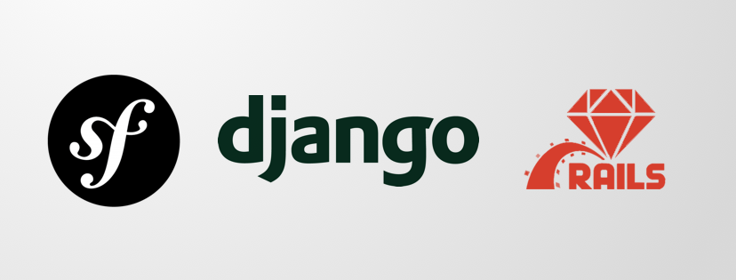
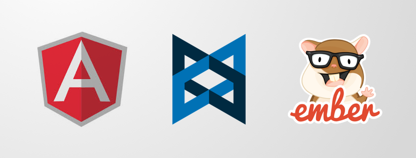

* 原文地址：https://hackernoon.com/goodbye-redux-26e6a27b3a0b
* 译文出自：TWNTF
* 译者：Yingjian Li

# 再见了, Redux

*完整分析我们过去为什么需要 Redux，以及为什么我们不再需要它的原因。*

在过去的几年中，互联网技术已经向前端 JavaScript 框架转移，以提高 Web 和移动应用的用户体验。这太棒了🔥，我个人十分喜欢这些框架的灵活性。

> 但是，太灵活了...

为了真正理解出现这种情况的原因，让我们回拨一下时间，看看应用程序在 JavaScript 框架存在之前是如何构建的。

## ⏳，在 JavaScript 之前

在最初的几个前端框架（最著名的应该是 AngularJS， Backbone 和 Ember）出现之前，我们曾经在服务器端渲染模板，然后将整个 HTML 页面发送给浏览器。当时流行的框架包括：



- Django(Python) — 2005年7月21日正式发布；~距今13年。
- Ruby on Rails — 2005年12月13日正式发布； ~距今13年。
- Symphony(PHP) — 2005年十月22日正式发布； ~距今13年。

这些框架的核心概念都是 MVC，也就是 Model-View—Controller 的应用开发结构。Models 是数据的『结构』，views 是『展示』数据的模板， controllers 负责将其『连接』。

> 这个时候当然也是有 JavaScript 的，只不过是一些像 jQuery 滑块以及一些实现弹跳动画的其他奇怪的库，这些都是完全没有必要的...

总的来说，使用这些框架构建的 App 表现得相当不错，但还是会有一些问题。 然后有一天，Ryan Dahl 灵光一闪，不再仅仅将 JavaScript 作为完成动画效果的工具。他开发了第一版的 Node.js， 使得开发者能够在浏览器外以及服务器端使用 JavaScript。

- Node.js — 2009年5月27日正式发布；~距今9年。

突然之间，人们开始意识到 JavaScript 强大的功能，只需要一点点代码就可以完成大量的工作。这也让其他开发者了解到了 JavaScript 的可能性。人们不仅开始为 Node.js 构建更多强大的工具，同时还开始创造有趣的前端框架。未来几年中 JavaScript 发展的雪球就是从这时开始的。



- Express.js(后端） — 2010年11月16日正式发布； ~距今8年。
- Backbone.js(前端） — 2010年10月12日正式发布； ~距今8年。
- AngularJS(前端） — 2010年10月20日正式发布； ~距今8年。
- Ember.js(前端） — 2011年12月8日正式发布； ~距今7年。

这使得 App 开发的方式发生了重大转变。之前完全由服务器进行处理的 MVC 结构被分成了两部分——处理 MC（models 和 controllers）的服务器，以及使用上述 JavaScript 框架处理 view 的前端客户端。在一些早期的框架中，view 中仍然包含 models 和 controllers。两份 model 和 controllers，有些在前端，有些在后端 — 听起来需要很多的代码。🙇🏽‍

## 🤦‍，Facebook 的问题

每个人都很开心。一切都正常运行而且易于理解，只需要花费几个小时来学习。

> 然后情况发生了变化

Facebook 迅速发展，成为了全球最大的 web 应用。你可以想象，作为最大的 web 应用会遇到很多的挑战。其中最头痛的就是如何在页眉中正确展示通知的数量。


随着人们大量的使用 Facebook 应用，人们期望应用中的通知应该能够正确更新。但通常情况下却不是这样的。我不清楚你是否在那个时候使用过 Facebook 或者是否还记得，但是这些通知经常是错的... 问题出在对于 web 应用来说很难识别出应用中某一部分的改变（阅读消息）并且影响应用的另一部分（减少未读消息数）。

这并不是最糟糕的事 — 这可以通过重载页面来解决 — 但 Facebook 拥有超过1000个充满热情的员工，并决定是时候做些事情了。因此他们重新思考了前端框架如何处理信息并且决定创造一个他们自己的前端框架；React。

- React（前端） — 2013年3月正式发布； ~距今5年。

这个新框架在渲染 HTML 方面的表现十分出色，而且十分原始，没有很多关于『如何』开发应用方面的内容。同样地，他们还发布了 Flux，最终发展成了Redux（Redo-Flux）。下面是 Flux 网站上2014/2015年的视频。[这个视频](https://youtu.be/nYkdrAPrdcw)主要讲解 Flux 和 React。

## 🍐...两者结合了

Redux 的工作方式是将应用中所有的动态信息存储到一个 JavaScript 对象中。当应用中的某部分需要展示数据时，它需要向服务器请求信息，更新 JavaScript 对象，最后将数据展示给用户。将所有信息存储到一个地方，应用总能正确地展示信息。因此解决了 Facebook 的通知问题。

突如其来地，React Redux 成为了构建应用的一个新框架。Facebook 努力解决了他们的问题，而且大家都很开心，对不对？

✋**并不。**

问题是，大家（包括我）开始使用一个对象存储所有的信息 — 服务器提供的全部数据。这确实可以维护所欲数据的最新状态，但是也有下面的三个问题：

1. 需要花费**大量的**额外代码，这将花费你的大部分**时间**。
2. 将所有代码放到一个地方，也会带来『数据过期』的问题，也就是说应用中可能出现来自之前状态的过期数据。
3. 对于新开发者来说，学习曲线陡峭，新手前端 web 开发人员很难采用这种技术。

如果我们设法将一个向用户展示数据的简单任务，从2005年的 MVC 框架中的模板迁移到现在的大型前端应用中，那么前端代码量是后端的10倍。例如我最近开发了一个简单的应用，并用[WakaTime](https://wakatime.com/)来测量我编程的时间。结果如下：

- React Redux 前端代码库 — 32小时。
- Express + Mongoose 后端代码库 — 4小时。

认真的吗？？🤯 我在前端代码上花费的时间是后端的8倍。让我们来看看为什么会需要这么多的代码。下面是我在前端代码库中添加基本的信息抓取请求时，需要的步骤：

``` 
🚧 警告：下面的内容技术性较强，请自由阅读。
```

1. 创建一个组件来展示用户列表（没有任何问题）。
2. 创建一个` fetch `请求 API。
3. 在 state 中添加新字段。
4. 添加一个更新 state 中数据的 action。
5. 添加一个 thunk 方法，来执行 `fetch` 并且用 action 来更新 state。
6. 使用 `connect()` 将 thunk 方法添加到组件中。
7. 再次使用 `connect()`，从 Redux state 中抽取数据。
8. 在组件的属性类型中声明 thunk 方法和抽取的数据。
9. 在 `componentDidMount()` 中调用 thunk 方法。
10. 最终在 DOM 中渲染数据。

我的老天鹅...10步...想当年使用 Ruby on Rails 的时候，我只需要把数据传给 HTML 就可以了。最后的结果是完全一样的。我意识到是时候做出一些改变了。

## ☝️，一个新方案

Redux 在解决前端应用同步的问题上十分出色，但是也带来一些其他的问题（像上面提到的）。仔细思考一下，Redux 给我们带来了什么额外的功能？

> 本质上来说，我们只是解决了一些不重要的问题。

Facebook 也已经注意到了这一点，并且开始使用 GraphQL 这样的新技术来解决这个问题。GraphQL 在当时是一个时髦的词，但我不清楚大家是否真的知道其中的**原因**。

GraphQL 与 Redux **完全**不同。Facebook 再一次推出了一款令人惊叹的产品，但是没能表述清楚为什么这款产品如此重要；所以我需要花费几分钟说明一下上下文。

> 总的来说，GraphQL 是汽车而 Redux 是马。

**什么？Redux 怎么会是马？**

我将两种技术描述成马和汽车的原因是；你不可能认为马和汽车是相似的 — 一个是四条腿的动物而另一个是装着轮子的机器。然而他们的最终目的都相同，都是将人送到终点。汽车在公路上行驶并需要燃料，然而马可以跨过岩石。他们各自的优势不同，适用场景也不同，但一般来说；汽车比马要快。

**那么，GraphQL 是什么**

官方文档将 GraphQL 描述为『GraphQL 是 API 的查询语言』十分模糊。本质上说，这里查询语言的意思是将一个 API 替换成了上百个 HTTP 端点。因为这个技术目前还不成熟，文档和支持还是有些难理解；也就是说还有一定的学习曲线。下面是一个例子。

GraphQL 将会替代下面的端点：

- GET `/user/1234567890`
- POST `/cars`
- PUT `/examples/endpoints`

还有只查询所需信息的自定义的查询，例如：

```
{
  user(id: "1234567890") {
    name,
    email
  }
}
```

将会返回：

```
{
  "user": {
    "name": "Luke Skywalker",
    "email": "luke@iamyourfather.com"
  }
}
```

等一下 — 自定义查询... 岂不是需要花很长时间来实现。 ~那只是你的想法

事实并非如此。原因是；当只请求需要的数据时，不再需要生成那么多的服务器请求，也就意味着你不需要写那么多的代码来处理这些请求。因此，您最终会在不必实现的代码上节省大量时间。

**🤷‍ 但这如何取代 Redux 呢？**

又一个好问题，感谢提问。简单来说，**不会取代** Redux。然而它却*鼓励*你*不要*将所有信息存在 Redux 提供的对象中。这是因为自定义查询不是为整个应用设计的，而是为特定部分设计的。在应用程序范围的数据源中存储特定部分的数据是一种反模式（也不符合逻辑）。

> 通过 GraphQL，可以减少对 Redux 的依赖，进而减少大量不必要的代码。

还值得注意的是；Redux 和 GraphQL 可以在一个应用中共存。这对于现有的 Redux 应用中集成 GraphQL 来说很有帮助。下面是关于如何实现的[文档](https://s3.amazonaws.com/apollo-docs-1.x/redux.html)。

在解决小问题时，Redux 成为了一个备选项。你可以选择使用它，但这同时会增加开销并引入其他问题，或者你也可以选择使用其他技术。

**好的，那么我们用什么技术呢？**

当时，Redux 是解决问题的好办法。但是随着 Web 开发的发展突飞猛进，web socket 领域也随之不断发展。

Web socket 是客户端与服务端间开放的连接，所以服务端可以通知客户端何时进行特定的更新。你猜怎么着？GraphQL以订阅的形式直接支持 Web socket。因此，我们可以使用订阅来更新我们应用中希望保持同步的部分。

这其中最大的区别是；不在需要客户端来通知我们某些组件需要更新（通过 Redux），而是我们的服务器通知客户端来更新数据。这两种方式的结果是一样的。下面是使用 MongoDB 和 Mongoose 实现 web socket 或订阅的例子。

[A Node.js Perspective on MongoDB 3.6: Change Streams](http://thecodebarbarian.com/a-nodejs-perspective-on-mongodb-36-change-streams.html)

[Mongoose v5.2.13: API docs](https://mongoosejs.com/docs/api.html#model_Model.watch)

## 🚀，未来看起来很美好！

GraphQL 已经开发了一段时间，但现在处于可以在生产中使用的阶段。坦白的说，它的文档非常难以理解，需要事先了解 JavaScript 以及服务器的工作方式。但是，如果你还不是很清楚 - 至少你知道目标是什么。这是一个常用教程的[链接](https://graphql.org/learn/)。

还有许多有用的库可以帮助你完成 GraphQL 的集成工作。别担心，你不必一次性的完成所有工作，这些库可以帮助你逐渐完成迁移。[Apollo](https://www.apollographql.com/) 是在这方便做的相当不错的一家公司。

就是这样。我希望这篇文章对于你理解这些复杂的概念有所帮助。

如果你喜欢这篇文章，你可以**鼓鼓掌** — 这对我来说很重要 — 或者如果你有任何的问题，欢迎留言！

谢谢！🙌

你也可以关注我的[推特](https://twitter.com/jacrobsco) 🦉 或者... 看看我其他的博客：

- [Startup Productivity Guide 101](https://medium.com/@jackrobertscott/startup-productivity-guide-101-85afdcf463fc)
- [How I Launched a Startup in 4 Days](https://medium.com/@jackrobertscott/startup-validation-done-right-6c7c62229e9)
- [Getting Your First 100 Startup Customers](https://medium.com/@jackrobertscott/getting-your-first-100-startup-customers-8cafd0ee8e7d)
